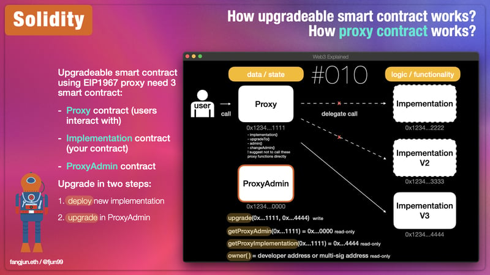
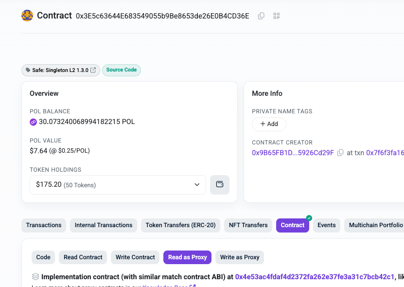
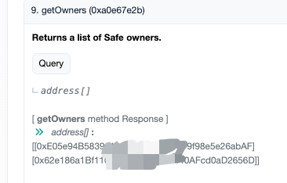
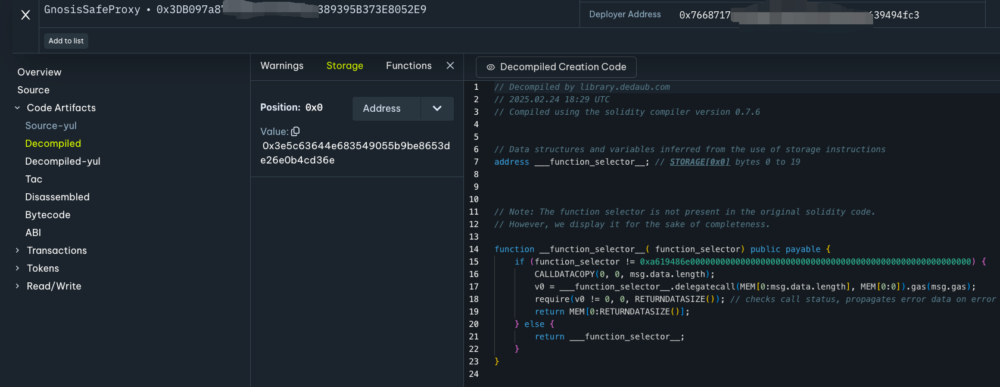
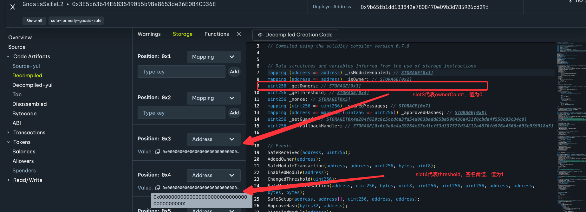
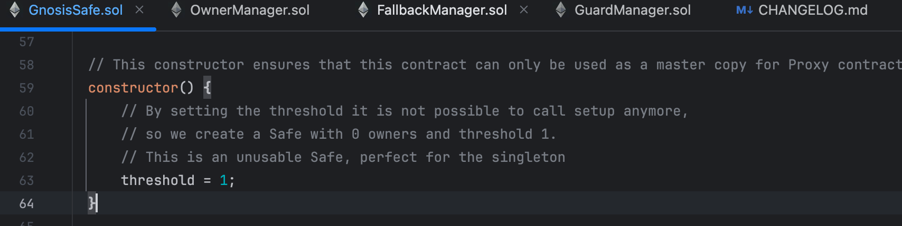
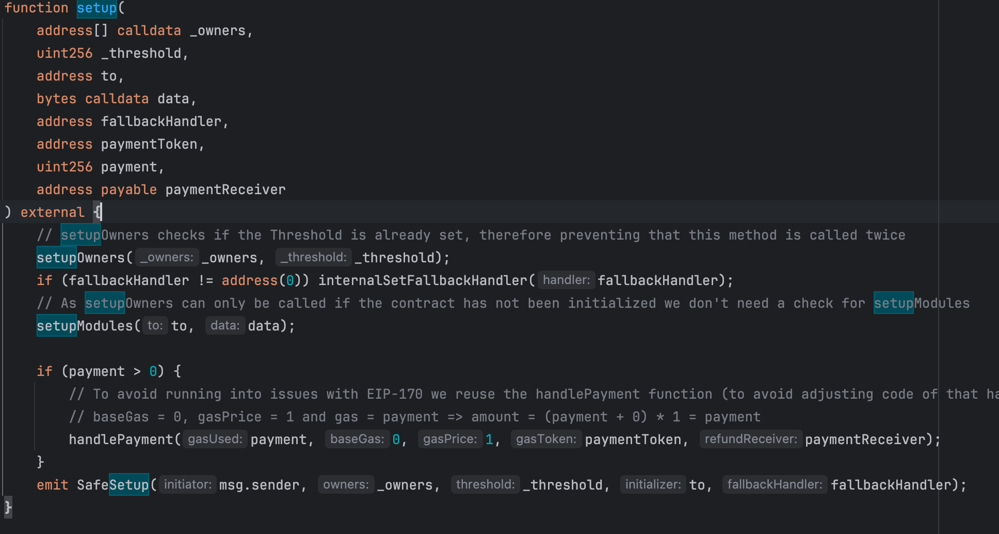
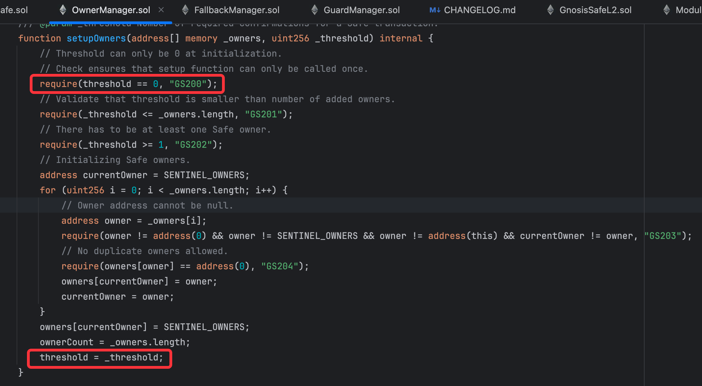
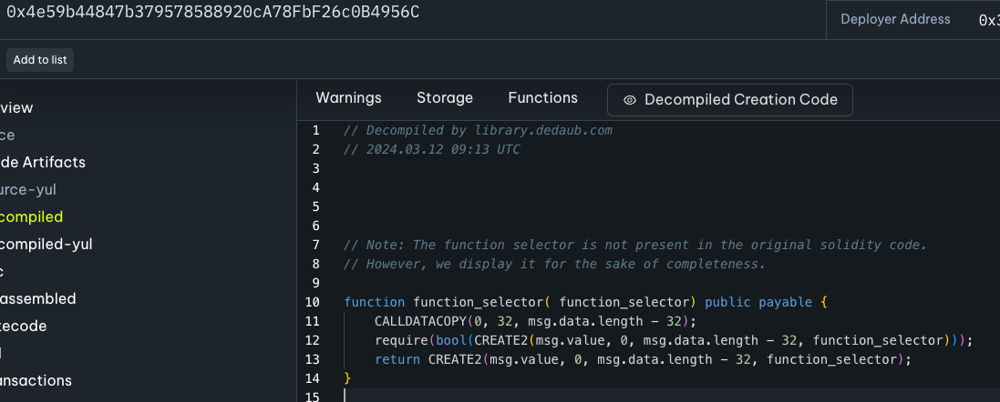

# 1 背景
## bybit安全事件
- 近期bybit出现了安全事故，被黑客盗走15亿美金资产
- 黑客控制了bybit团队使用的safe钱包，并利用safe合约机制替换了其impl合约完成了资金的盗取操作
- safe和 mandiant 团队关于事故的初步分析 https://x.com/safe/status/1897663514975649938
## safe合约架构
- 目前safe合约架构为proxy + impl方式，数据存储在proxy合约，实际的逻辑由impl合约实现。
- 其中该impl合约是safe团队已经提前部署好的合约地址，叫做“masterCopy”，实际是一个safe1.3.0版本的合约
  - 地址为：0x3E5c63644E683549055b9Be8653de26E0B4CD36E
## 潜在风险点
- 在polygonscan.com上，该masterContract地址看起来像是一个proxy合约
  - 该proxy合约（masterCopy）地址的控制权在谁手里？
  - 该proxy合约（masterCopy）是否存在被update或者revoke的风险？
  - 
# 2 结论
   - 无对应风险，masterCopy合约不是proxy架构，且无有效owner可以发起任何交易
   - polygonscan上看到的masterCopy合约是一个proxy架构，这个页面展示是错误的。
# 3 详细分析（以某个safe地址为例）
## 某个safe地址
- 地址 0xE4dD515Cf1Bd1F.........300Fd074aB68D5Bff
- owner信息如下
- 
## 该safe地址的runtimeCode反编译
- 该合约地址的code较短，反编译后内容如下，即将几乎所有请求都通过delegatecall其slot0中存储的合约来实现
- 
- 能看出其的impl地址即为 masterCopy合约，符合背景中提到的proxy + impl合约架构 （slot0存储的地址为 0x3E5c63644E683549055b9Be8653de26E0B4CD36E）
## masterCopy合约的反编译

从图中能看出来，
- 首先，masterCopy合约拥有完整逻辑，**不是一个proxy + impl的合约架构**。
- 其次，这个masterCopy合约存储中已有签名阈值（threshold, slot4）为1，ownerCount(slot3)为0，
  - 代表该合约实际上是一个矛盾的状态（无法达到1这个签名阈值，以发起任何交易，包括update和invoke）
- 注意这里的threshold = 1发生在masterCopy合约的存储中，根据这个合约派生的其他proxy合约的对应threshold仍然是0
  - 因为在proxy + impl架构下，proxy合约自己存储数据，只使用impl合约的代码逻辑（而不是存储）
  - 所以masterCopy合约里的，threshold = 1并不会被带到被创建出来的proxy合约中
- 在safe的合约代码中，也能看到对这部分的逻辑说明 
  - 确保"is an unusable safe " that a singleton should be

# 4 safe合约中owner的初始化流程（setup方法）
- safe合约在创建后，需要由外部服务主动调用setup方法进行初始化，包括owner列表，module加载等

- owner初始化逻辑部分，可以看到，2个红框确保了一个safe合约无法被二次调用setup逻辑!

# 5 (番外) masterCopy合约的创建
- safe团队调用另外一个公开的，定制化的工厂合约创建新合约
## 工厂合约
- 无selector解析逻辑，将对应deploy需要的calldata直接传递给create2信令
- 地址 0x4e59b44847b379578588920cA78FbF26c0B4956C
- 代码反编译
## 创建操作

- tx Hash 0x7f6f3fa161872acccf6ec25b344274d95777f1b1f30dd8b3578ef173db9a2985
- 能明确看到，在创建之后，constructor函数被自动执行，将slot4的内容改为了1（threshold）

