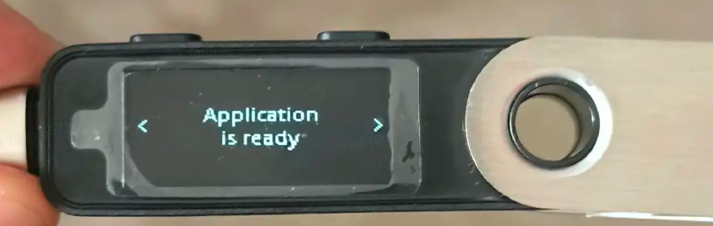
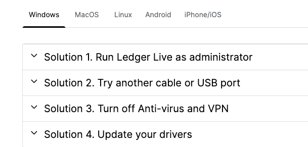
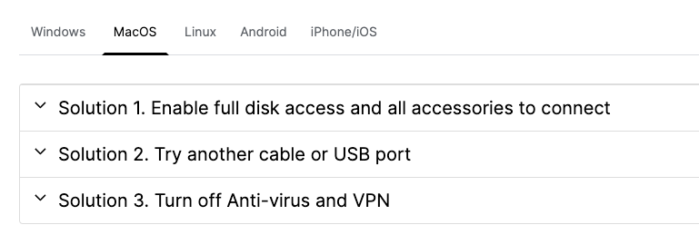

# 1 背景

Ledger 设备偶发出现无法连接到dapp的问题

# 2 推荐流程（ledger设备直连pc场景下）

1. 使用usb线连接ledger设备和pc，
2. 输入密码，解锁ledger设备（确保设备上有“ethereum”这个app）   
3. edger设备进入“ethereum” app   
4. 在dapp里点击选择ledger登录，弹出“地址选择框”
   1. （框内左上角有“base path”字样）。

5. 点击scan addreesses
6. Scan addresses转圈完毕，选择下方其中一个地址，点击“connect”
7. 完成ledger直连登录。

# 3 Tips

1. usb线需要确保能传输数据，且win台式机最好插在机箱后侧避免电压波动
2. 如果出现异常，需要刷新web page的时候，需要关闭“地址选择框”之后再刷新
   
   1. 如果不关闭就刷新，可能导致仍然报错
3. pc上的Ledger live app可以关闭或者直接不开启，不启动ledger live app，ledger设备仍然可以正常签名等。
4. pc上的ledger live app如果运行，不能处于左侧“我的ledger”页面
   
   1. 进入“我的ledger”页面后，会自动弹出 设备上的“ethereum”等app，导致检测和操作失败。
5. pc上的Ledger live app如果运行，权限需要足够
   
   1. win上需要“以管理员身份运行”
   2. macos上需要“完全的磁盘访问权限”

# 4 常见报错

1. 提示 Ledger device: Locked device (0x5515)
   
   1. 代表ledger设备已经自动锁屏，需要输入密码并解锁
   2. 不用刷新web页面，在ledger设备上解锁后，再次点击按钮即可重试。
2. 提示 Ledger device: UNKNOWN\_ERROR (0x6511)
   
   1. 代表此时ledger设备上没有进入“ethereum” app，需要进入后再重试
   2. 不用刷新web页面，在ledger设备上进入该app后，再次点击按钮即可重试。
3. 提示 Failed to execute 'transferOut' on 'USBDevice': The device was disconnected.
   
   1. 代表此时ledger设备被取出（或者usb连接异常），~或者pc端的ledger live app并没有启动~
   2. 需要重新插拔ledger设备
   3. 需要关闭“地址选择框”并刷新页面重试

# 5 其他环境问题排查

1. [ledger官方问题排查qa](https://support.ledger.com/article/115005165269-zd)

   
   

