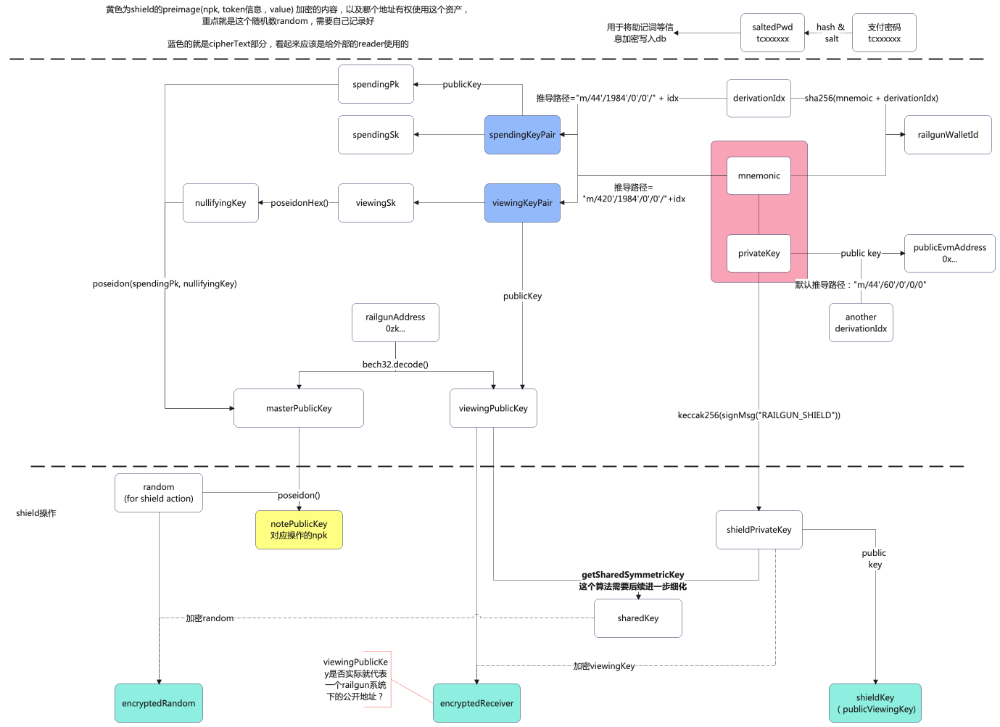

# 前言

- 由于railgun privacy的知识点相对较新，系统中涉及的各种key也较多，所以单独有本篇分享
- 工作较忙，更新可能断断续续

# 账号体系一览

- 可以看到，整个public 和 private的账号体系均由一个私钥推导得出
  
  - spendingKeyPair和viewingKeyPair是private体系下的所有key来源
  - 各个key的派生过程均类似于单向摘要，即知道上一个能推导出下一个，反之不行
- code bases are
  
  - https://github.com/Railgun-Community/engine.git  9.3.1
  - https://github.com/Railgun-Community/wallet.git 10.3.3

---

