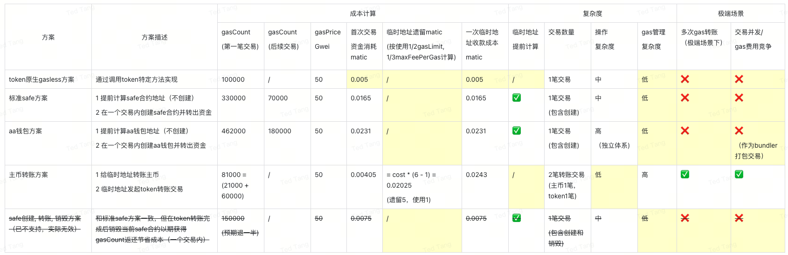

# 1 背景

- 某公司业务需要在多个链上进行erc20 token的收款，每次收款给出的都是一个新创建的临时地址，该地址上的资金经过了kyx, aml等检测之后会回收到公司的自有资金钱包中。
- 问题点在于，这些地址上没有native currency来支付gas费用，所以需要一些gasless方案
  - gas的管理成本
  - gas在临时地址上的遗留成本

# 2 结论

## 采用

- 如果该erc20 token本身支持gasless的交易方式，则最佳
  - a转账给b，该token支持a线下签名，由c提交交易到链上并支付gas费用
- 如果该erc20 token不支持，则选择使用safe web3合约钱包来收款
  - safe合约钱包支持由外部地址提交交易到链上，safe owner同样只需要链下签名

## 不采用

* 不使用native currency转账方案，因为资金成本差距不大
  * 实际上链交易的gasCount/gasLimit \* gasPriceCost/maxFeePerGas  < 0.24 时，使用成本 >= safe方案
    * 即需要gasLimit和gasPrice尽可能接近，这个方案才有更低的消耗
  * 相比safe方案，多了gas管理的复杂度，无法并发执行交易等。
* 不使用aa钱包方案，因为成本太高（甚至高于safe方案）
* 不使用safe的收款并销毁方案（使用标准safe方案），因为evm已经不支持gas count返还信令，所以意义不大

## 实际的消耗对比
黄色背景单元格即为比选中较优的选择


# 3 gasless方案思路

- 核心思路是避免直接转账gas，虽然简单粗暴，但是gas管理等成本较高
- 如果token本身支持gasless的交易，最优选择
- 如果不行，则使用safe多签钱包的方式进行处理
  
  - 提前计算safe钱包地址，用户充值后再创建safe合约并转出资金
  - 如果用户没有实际转账则可以不用实际创建该safe钱包，节省资金

# 4 gasless方案比选（按优先级排序）

## token原生gasless方案

- Polygon-usdt
  
  - metaTransaction方案
- Polygon-usdc
  
  - transferWithAuthorization方案

## 标准safe方案

1. 思路
   1. 提前计算safe钱包地址，然后需要归集的时候一个交易中实现2个操作，创建safe合约并进行token资产转出
   2. 在vvbusiness中已实现类似功能，复杂度中等，但是使用简单（已封装接口）
2. 部分交易数据

https://polygonscan.com/tx/0xf6079a4a03c8b17603362f28147e2e25b55f6030ccdf90bd1f221ae8f1b970ad

## aa钱包方案

1. 主要特点
2. 成本高
   
   1. 比safe方案还高
3. 技术复杂
   
   1. 实际实现方式不符合原有的预期，不是选择给已有eoa地址提供能力，跟ca钱包没实际区别
   2. 交易的提交走的另一条路，发送到新的mempool给bundle进行打包，最终交易上链。
4. 各家厂商几乎已实质性放弃
   
   1. 大部分接入过aa钱包的厂商已经放弃（如okx）
   2. 目前只找到tokenPocket还在支持
5. 部分交易数据
   
   1. aa钱包转账交易（第一笔，包含创建）    https://polygonscan.com/tx/0x76807fa159bce1cd4e81be75e5f26a53ffc30e1552e00b4ad7408519bcff230e
   2. aa钱包转账交易（第二笔，不含创建）https://polygonscan.com/tx/0xd23b89abe7b763a9f2eb7e8411ffd4e0a6610ecc111c8195cb5399a6a3f99871

## 主币转账方案

1. 思路
   1. 非常常规，先转账主币给临时地址，临时地址收到了主币再构造token转账交易。但存在2个比较明显的问题
   2. 分类
      1. 固定临时地址（和用户一一对应）（币安等交易所）
      2. 随机临时地址（和订单等一一对应）
2. 问题
   1. gas管理
      1. 2笔交易导致事实上的交易变慢
      2. 增加额外的gas管理成本
      3. 无法支持后续的交易打包（避免交易量多的场景下，自身之间相互竞争gas费用）
      4. gas费用波动场景下，可能需要第二次主币转账（之前转账的余额不够提交，但事实上可能遗留）
   2. 临时地址资金遗留
      1. 相当于第一笔交易给临时地址的主币，临时地址在使用时几乎是一定会遗留一部分无法支取
      2. Gas count 无法使用完毕
         实际交易使用的gas count只能 使用到 gas limit的 1/2 左右，使用率太高可能因为波动导致失败
         
         ```
         另：arbitrum的gas limit出奇的高
         ```
      3. Gas price 无法使用完毕
         实际使用的gas price 只能使用到max fee per gas 的 1/3 左右， 使用率太高可能因为波动导致交易迟迟得不到打包。
         
         ```
         另：高峰期交易的gas price预估数据会明显偏高
         ```

## safe销毁方案

1. 跟标准方案类似，但是一个交易中实现3个操作，创建safe，转移token，销毁该safe合约
   1. 好处是预期能获得合约销毁时的gas count返还，一般都能给到1/3或者1/2
2. 实际不能使用的原因：
   1. eip3529 移除了selfdestruct信令对于gas count的返还
      1. 可能导致gas count套利
      2. 可能导致突破block的最大限度上限（self destruct本身需要执行额外的信令, 退款等）
   2. eip6780 进一步限制了selfdestruct信令只能在和创建同一笔的交易内生效，否则几乎没有任何功能
      1. 为了以太坊未来的verkleTree迁移，主要要求是合约代码等数据部署后不能变更，因为会关联到多个tree结构中，root tree无法链接

