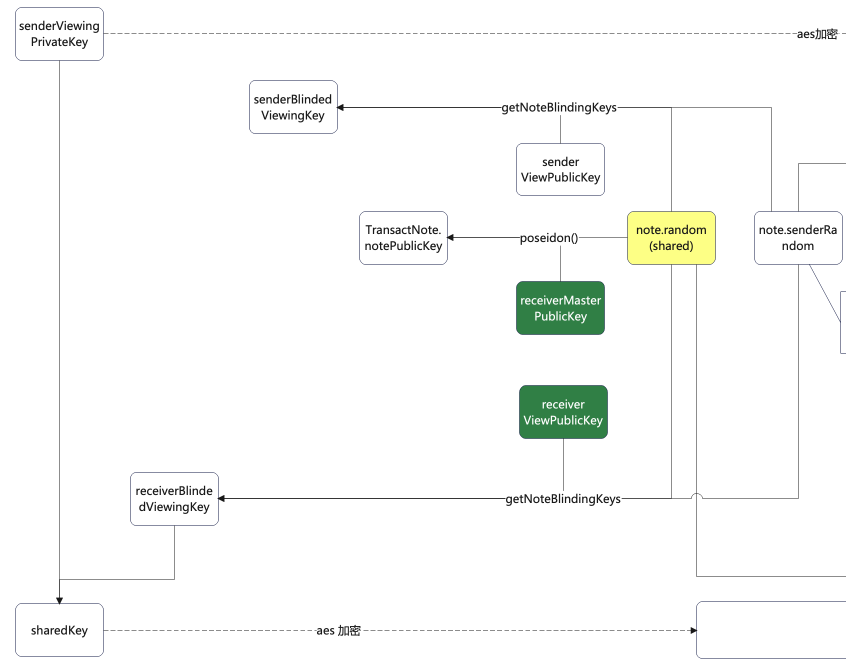
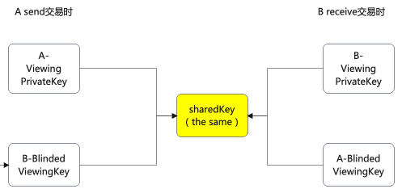

# 场景和疑问

## 场景（railgun privacy）

### 加密流程简图

### 加解密过程对比简图

## 场景（简化后）

- 场景举例中简化了对于railgun privacy note的加解密计算
- 我有一个viewingKeyPair, 包含一个公私钥对，B也有一个viewingKeyPair.
- 我用B的viewingKeyPair.publicKey计算生成了一个BlindedViewingKey1,
  - 然后用我的viewingKeyPair.privateKey一起计算得到一个key，用这个key进行aesGCM的加密得到密文。
- B用我的viewingKeyPair.publicKey也得到了一个BlindedViewingKey2,
  - 然后和B自己的viewingKeyPair的PrivateKey计算得到一个key，这个key也能对这个密文进行解密。
 

## 问题

- 为什么B完全没有用到我的2个输入，但是也能解密这个密文？
- 这个是不是说明我和B计算得到的key相同？

# 原理

- 迪菲 - 赫尔曼密钥交换是一种让双方在不安全的通信信道上安全地交换密钥的方法，
  - 双方可以基于各自的公私钥对和对方的公钥，通过特定的数学运算得到相同的共享密钥。

- 在railgun privacy的note加解密场景中中，虽然使用了 `BlindedViewingKey` 这种盲化处理，但核心原理是相似的

## 重点算法

- Diffie-Hellman Key Exchange
- 有点同态加密的感觉，mpc算法简化版本
  - mpc中是同态乘法和同态加法的变化，这个看起来就是同态的乘法之间？

# 代码演示

# gpt的答案

#### 1. 你生成密钥的过程

* 你使用 B 的 `viewingKeyPair.publicKey` 计算生成 `BlindedViewingKey1`。这个过程可能涉及到一些盲化算法，目的是增加密钥的安全性和隐私性，但本质上还是基于 B 的公钥进行计算。
* 然后你用自己的 `viewingKeyPair.privateKey` 和 `BlindedViewingKey1` 一起计算得到一个密钥（假设为 `KeyA`）。这个计算过程通常是一种数学上的乘法运算，例如在椭圆曲线密码学中，是点乘运算。

#### 2. B 生成密钥的过程

* B 使用你的 `viewingKeyPair.publicKey` 计算生成 `BlindedViewingKey2`。同样，这也是基于你的公钥进行盲化处理。
* 然后 B 用自己的 `viewingKeyPair.privateKey` 和 `BlindedViewingKey2` 一起计算得到一个密钥（假设为 `KeyB`）。

#### 3. 为什么 `KeyA` 和 `KeyB` 相同

在椭圆曲线密码学中，假设你有私钥 `a` 和对应的公钥 `A`，B 有私钥 `b` 和对应的公钥 `B`，公钥是通过私钥与椭圆曲线上的基点 `G` 进行点乘得到的，即 `A = a * G`，`B = b * G`。

你计算共享密钥时，是用自己的私钥 `a` 与 B 的公钥 `B` 进行点乘，得到 `KeyA = a * B = a * (b * G)`。

B 计算共享密钥时，是用自己的私钥 `b` 与你的公钥 `A` 进行点乘，得到 `KeyB = b * A = b * (a * G)`。

根据椭圆曲线点乘的结合律，`a * (b * G) = b * (a * G)`，所以 `KeyA` 和 `KeyB` 是相同的。

# 结论

在railgun privacy的场景中，虽然引入了盲化处理，但盲化处理只是在公钥的基础上进行了一些额外的计算，并不影响最终基于私钥和对方公钥计算共享密钥的本质，所以你和 B 最终计算得到的密钥是相同的，从而 B 能够用这个密钥对密文进行解密。

  

