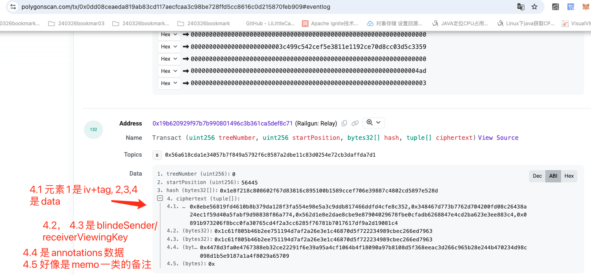

# 背景和目的

- railgun privacy 集合了tornadoCash, zcash等隐私交易先辈的优势，同时自己又有大量的新设定，比如改成utxo，支持private swap等，
- 本人零知识领域知识储备不足，概念上得太多，官网的文档又说得过于浅表，很难全部理解和吃透。只能老老实实的怼代码。
- 先从外围逻辑入手，逐步深入，最终理出各种重点数据流
- 学习的过程就是不断提出问题和回答问题
  
# 更新记录
- 250323 还在过railgun privacy的外围逻辑，预计3月底4月初部分开始进入zk逻辑核对部分
# railgun privacy重点技术问题

## railgun privacy账号体系构成？

> 详情参考 [railgun privacy 账号体系](https://github.com/TangCYxy/Shares/tree/main/250313%20railgun%20privacy%E8%B4%A6%E6%88%B7%E4%BD%93%E7%B3%BB%E5%88%86%E4%BA%AB)

## railgun privacy中，账号体系设置得这么复杂的原因？

> 比如举个例子，为什么不直接使用spendingPublicKey作为masterPublicKey？

## railgun privacy 如何实现的隐私utxo交易(shield/privateTransfer/unshield/privateSwap)？

## railgun privacy 对内部的merkleTree做了哪些优化？

- 参考tornadoCash，提前计算高度为16的merkleTree的

## railgun privacy 和tornadoCash，ZCash等实现的异同？

## railgun privacy 如何做到仅交易双方对交易记录可见？

> - 交易的信息被编码在commitment中
> - 每个commitment的关键信息被sharedKey加密，只有拥有sharedKey的人才能解密这个commenti
> - sharedKey使用双方的viewingKeyPair进行diffieHellman密钥交换计算
> - 交易的receiver和sender分别使用自己自己的viewingPrivateKey（私有）,  以及对应leaf节点中公开可见的commitment.senderBlindedViewingKey(或receiverBlindedViewingKey)进行计算，得到相同的sharedKey，进而可以解密commitment.cipherText对象
> - 详情参考 [railgun privacy中diffieHellman密钥交换算法的分析和应用](https://github.com/TangCYxy/Shares/tree/main/250318%20railgun%20privacy%E4%B8%ADdiffieHellman%E5%AF%86%E9%92%A5%E4%BA%A4%E6%8D%A2%E7%AE%97%E6%B3%95%E7%9A%84%E5%88%86%E6%9E%90%E5%92%8C%E4%BD%93%E7%8E%B0(%E4%BA%A4%E6%98%93%E5%8F%8C%E6%96%B9%E8%A7%A3%E5%AF%86Note  )

## 如何理解zk的证明本身？

> 概念很简单，就是不暴露自己手里的数字，通过计算另一个数据向外证明，但是在工程上的处理逻辑还是一个比较明显的知识短板。
> 参考B站大佬的分享，手写一个类似tornadoCash的全套逻辑。

## railgun privacy系统中的POI是如何操作的，如何访问，存储，验证等

> 

## railgun privacy系统中，使用broadcaster进行交易广播的操作对交易流程本身有哪些影响？

> 

## 为什么设计中非得内嵌一个db对象，而不是定义为接口？

> 这样很难移植到后端服务，不太理解

# 详细QA

## app理解

### [macos app]创建账号时，要求用户分别记录助记词，spendingPrivateKey和viewingPrivateKey, 但是导入账号时只需要助记词，这是不是说明整个railgun账号体系都是从这个一个助记词派生的？如何派生的呢？

> - 确实是从这个助记词里派生出来的所有地址，包括0zk和0x.

> - 详情参见 [railgun privacy 账号体系](https://github.com/TangCYxy/Shares/tree/main/250313%20railgun%20privacy%E8%B4%A6%E6%88%B7%E4%BD%93%E7%B3%BB%E5%88%86%E4%BA%AB)

### masterPrivateKey的使用场景具体是什么？看起来基本都是使用spendingPublicKey, msaterPublicKey以及viewingKeyPair？

> 

### viewOnly钱包是怎么理解的呢？是如何做到只能看，不能交易的？给出的形式是只有viewingPublicKey，还是说要连着viewingPrivateKey一起给出呢？

> - 因为viewingKeyPair主要是处理commitment的解密，spendingKeyPair才是处理资产交易相关的认证。所以只给出viewingKeyPair并不影响某个0zk地址的交易安全性
> - 需要连着viewingPrivateKey一起给出，因为解密commitment需要计算一个sharedKey，sharedKey本身是由交易的其中一方拿自己的viewingPrivateKey（私有）和commitment中的blindedKey进行计算得到。所以在viewOnly钱包中，实际上包含viewingPrivateKey 和 viewingPublicKey

## 源码阅读

### railgun privacy中有几种npk（notePublicKey），或者说有几种note？

> 250323 至少2种。transactCommitment和unshieldCommitment, 前者一般是隐私交易(0)，broadcasterFee(1), 以及changeOut找零转账(2)，后者代表unshield操作。transact是使用得最主要，最广泛的功能

### railgun合约注释中，notePublicKey = Poseidon(Posiedon(spendingPublicKey, nullifyingKey), sharedRandom), 但是js的lib中npk看起来就等于简单的Poseidon(masterPublicKey, sharedRandom), 是注释没对上还是？

> 两种说法都正确，masterPublicKey在railgun privacy账号体系中，就是 = Poseidon(spendingPublicKey, nullifyingKey)

### shield的主要流程

> 进行中

### privacy transfer的主要流程

> 进行中

### unshield的主要流程

> 进行中

### private swap的主要流程

> 进行中

### railgun privacy中的merkleTree zeros是否跟tornadoCash的优化思路一致，有区别吗？

> 

### [terminalWallet]为什么wallets对象里，masterPublicKey和spendingPublicKey不一样呢？

> 实际上就是不一样的。masterPublicKey是由spendingPublicKey推导而来

### [terminalWallet]如何监听链上最新的tree变动的呢？

> sdk中会定期获取链上最新的event事件信息，然后全部落库到本地内部db中。
> 然后定时任务同步leaf节点的高度，从db中获取所有的中间高度进行并行解密

### [terminalWallet]在一个leaf的解析过程中，可以同时解析出来自己的receive和send吗？

> 可以，比如privateTransfer中的找零交易，就是sender和receiver都是自己的masterPublicKey

### 为什么sender和receiver能用自己的privateViewingKey和blindedViewingKey计算得到相同的sharedKey？

> - 详情参考 [railgun privacy中diffieHellman密钥交换算法的分析和应用](https://github.com/TangCYxy/Shares/tree/main/250318%20railgun%20privacy%E4%B8%ADdiffieHellman%E5%AF%86%E9%92%A5%E4%BA%A4%E6%8D%A2%E7%AE%97%E6%B3%95%E7%9A%84%E5%88%86%E6%9E%90%E5%92%8C%E4%BD%93%E7%8E%B0(%E4%BA%A4%E6%98%93%E5%8F%8C%E6%96%B9%E8%A7%A3%E5%AF%86Note  )

### [POI]为什么转账后，得到的changeOut余额会自动变成missingExternalPOI这个状态，是怎么计算的呢？为什么在walletTools里直接生成一下就可以使用了呢？

> 

### 在unshield操作发生时，实际产生了几笔交易？（有资金遗留）

> 2笔交易。一笔transact（changeOut），sender和receiver都是自己，另一笔是unshield

### [broadcaster]使用broadcaster进行交易时，交易手续费是直接给了broadcaster的0zk地址，还是给的0x地址？

### [terminalWallet]wallet.sign()部分的作用是什么？在哪里验证？

> 

### senderRandom的作用具体是什么？仅sender可见的annotations结构里还有walletName, TxType

### sender在发起交易的时候，可以隐藏自己的身份吗？或者说，在receiver收到交易的时候，是怎么获取得到sender的masterPublicKey地址的？

> - sender可以在构造交易的时候，选择将encodedMPK字段简单的设置为receiver.masterPublicKey的值来进行操作
> - 相当于交易信息里本身是没有sender和receiver的，只是说在什么场景下，要添加sender的地址信息和receiver的地址信息等。
> - 正在写文档，估计下周完成并提交

### private transfer交易的commitment数据构成

> - 
> - 
### [terminalWallet]note.hash是怎么计算的，有什么作用吗？

> - 实际上就是commitmentHash，等于poseidon(notePublicKey, tokenInfoHash, tokenValue)
> - 

## 测试操作解析

> 

