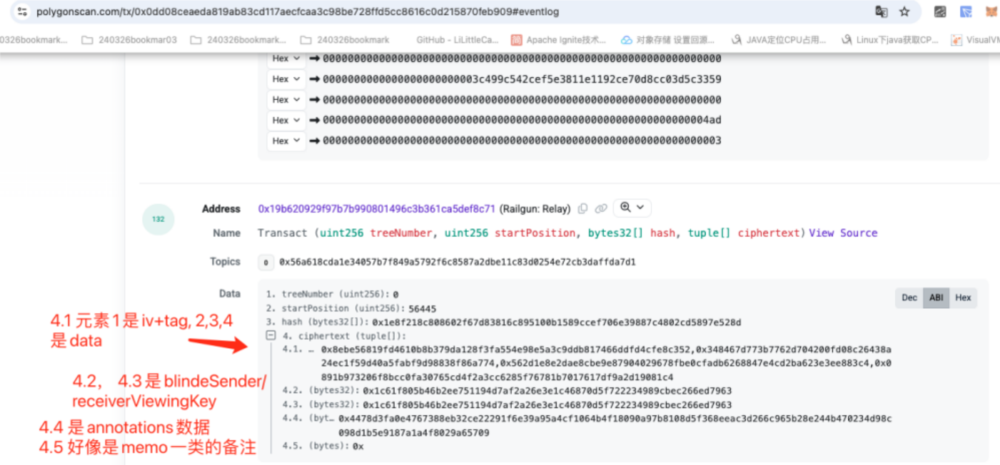
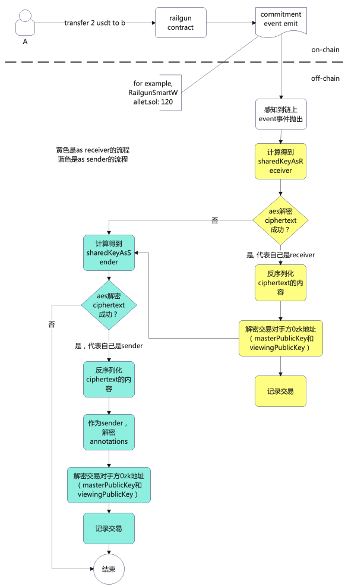
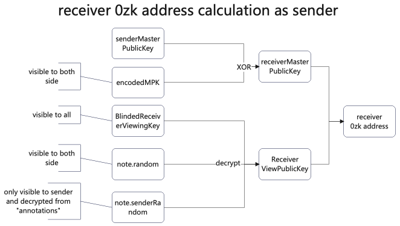
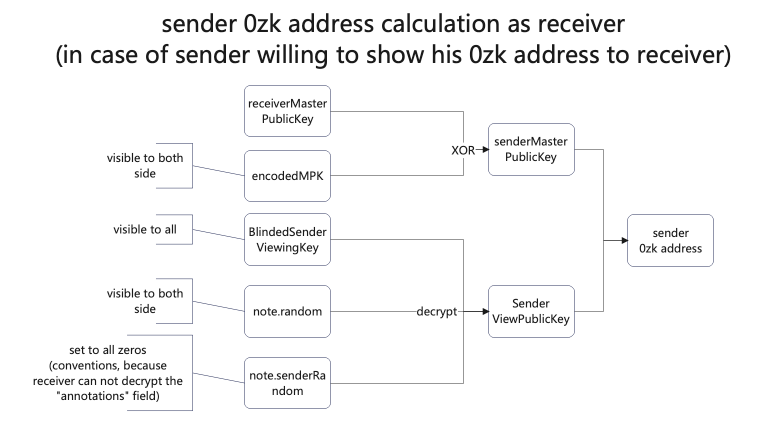

# 目的

- 通过数据流图的方式来说明交易双方对链上交易的感知流程
- 结合sdk代码逻辑的实现

# 原理

监听链上每个transact event，如果自己能解密对应的密文，则自己就是对应的receiver（或sender）

## 交易数据获取（对链上transact event的解析）



## 仅交易双方可见的加密数据块

- 根据链上transact事件的数据，结合自身viewingPrivateKey尝试生成sharedKeyAsReceiver(和sharedKeyAsSender)
- 尝试用这两个key去解密commitment.cipherText, 如果能解密成功，代表自己就是交易的receiver(或sender)
  
  - 通过diffieHellman key exchange算法确保只有交易双方能生成正确的aesKey
  - 详情参考 [diffieHellman密钥交换算法在railgun privacy系统中的应用](https://github.com/TangCYxy/Shares/tree/main/250318%20railgun%20privacy%E4%B8%ADdiffieHellman%E5%AF%86%E9%92%A5%E4%BA%A4%E6%8D%A2%E7%AE%97%E6%B3%95%E7%9A%84%E5%88%86%E6%9E%90%E5%92%8C%E4%BD%93%E7%8E%B0(%E4%BA%A4%E6%98%93%E5%8F%8C%E6%96%B9%E8%A7%A3%E5%AF%86Note)) )
  
  ## 交易对手方0zk地址的解析
- 解密成功后，进一步解密对应的交易涉及的资产信息和交易对手方0zk地址
  
  - 通过encodedMPK和senderRandom字段，在作为sender和receiver的时候分别能正确解析对手方0zk

## 核心代码方法

```
> railgun-sdk项目
> abstract-wallet.createScannedDBCommitments(viewingPrivateKey) TransactCommitmentV2流程
```

# 常规交易场景

A有一个10USDT的UTXO，给B转账了2USDT，自身剩余8USDT

## UTXO流转图


## 交易创建-感知生命周期数据流图



## 对手方0zk地址的计算

按照前述的[railgun privacy账号体系](https://github.com/TangCYxy/Shares/tree/main/250313%20railgun%20privacy%E8%B4%A6%E6%88%B7%E4%BD%93%E7%B3%BB%E5%88%86%E4%BA%AB),0zk地址主要由 masterPublicKey和viewingPublicKey 构成

### 对手方0zk地址的计算数据流(as sender)



### 对手方0zk地址的计算数据流(as receiver)

- 如果sender希望自己的地址对receiver不可见，会设置encodedMPK字段为receiver的masterPublicKey。
  - 此时作为receiver，无法解密得到sender的0zk地址
- 这里就只讨论sender希望自己地址对receiver可见的场景  

