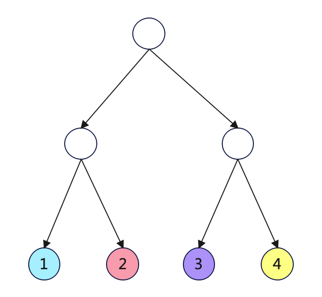
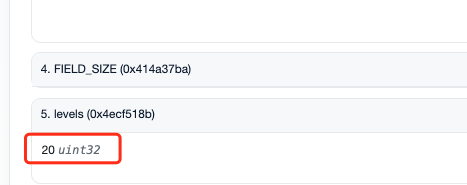
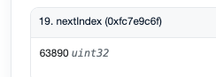
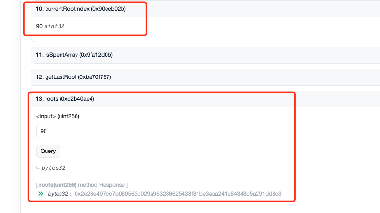
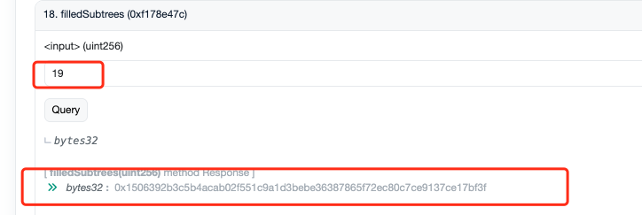
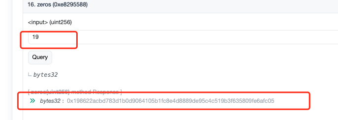
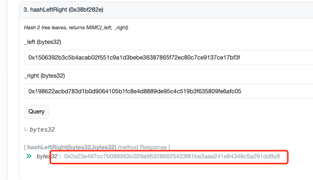

# 背景

- 作为著名的隐私交易实现，tornadoCash使用了incrementalMerkleTree来记录所有的存款行为（和deposit对应的leaf）
- 特点：
  
  - 高度固定，所有节点固定填充为hash(0)或者某个特定值
  - leaf节点从左往右依次插入，插入leaf相当于就是把该节点的值替换为新插入leaf的hash
  - leaf插入后不删除
  - 使用特定数据结构压缩存储左侧已经在树上的leaf信息(filledSubtrees)

# 总结

在tornadoCash的实现中，如果定义某棵incrementalMerkleTree深度是20， 那么这棵树的实际高度是21（20 + 1），实际使用计算中一定要注意这一点

# 重点概念

## 二叉树的高度

- 如果一个二叉树高度为n，其将拥有总共2^n - 1 个节点, 其中2^(n-1)为叶子节点
- 下图即为一个高度为3的二叉树，总共有7个节点，4个叶子
  

## 二叉树的深度（在tornadoCash体系中）

- 在tornadoCash中，将二叉树的深度定义为levels。
- 上一节中的二叉树，在tornadoCash中表达为 levels = 2的incrementalMerkleTree
  
  - levels = 0时，即为最下层的叶子节点（4个）
  - levels = 1时，即为中间的节点（2个）
- merkleRoot即为二叉树最上方的节点值（注意不属于levels的范围）

# 链上数据说明

## tornadoCash合约已使用的深度定义

- 根据[tornadoCashethereum合约地址](https://etherscan.io/address/0x47ce0c6ed5b0ce3d3a51fdb1c52dc66a7c3c2936#readContract )
  可以看出，tornadoCash在eth主网上定义的incrementalMerkleTree深度为20
  

## incrementalMerkleTree数据使用情况

- 从最新的leafIndex数据可以看出，最新leaf才60000+， incrementalMerkleTree还几乎很空

## 当前的merkleRoot

- 可以看到，当前merkleRoot的最新idx是90，
- 取出roots[90], 得到当前的merkleRoot  0x2e23e497cc7b089563c029a963286625433f81be3aaa241e84348c5a291dd8c8
- 

## 最大左子树merkleRoot

- 按照tornadoCash的merkleTree优化，新leaf左侧均为已添加的leaf，值被缓存在结构filledSubtrees结构中
- 该结构最大的值即为最大左子树的merkleRoot
- 
- 上方红框，20层深度，levels值的可用范围即为[0, 19]

## 最大右子树merkleRoot

- 按照tornadoCash的merkleTree优化，新leaf右侧均为未使用的zeros，值被按全0子树高度提前计算（zeros(0), zeros(1)...zeros(19)）
- 因为树还很空，所以右侧子树肯定是全0，所以取level = 19的zeros（理由同上，最大的子树level为19）
- 

## 使用最大左右子树复现merkleTree

- 使用刚得到的最大左子树merkleRoot和最大右子树merkleRoot, 能得到最终的merkleRoot，与链上查询得到的数据一致
- 

