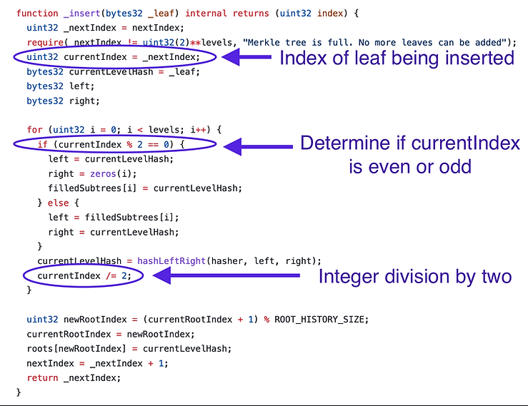
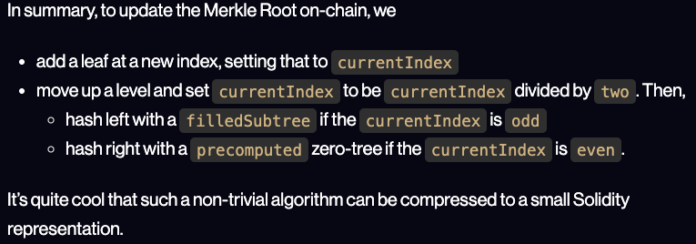
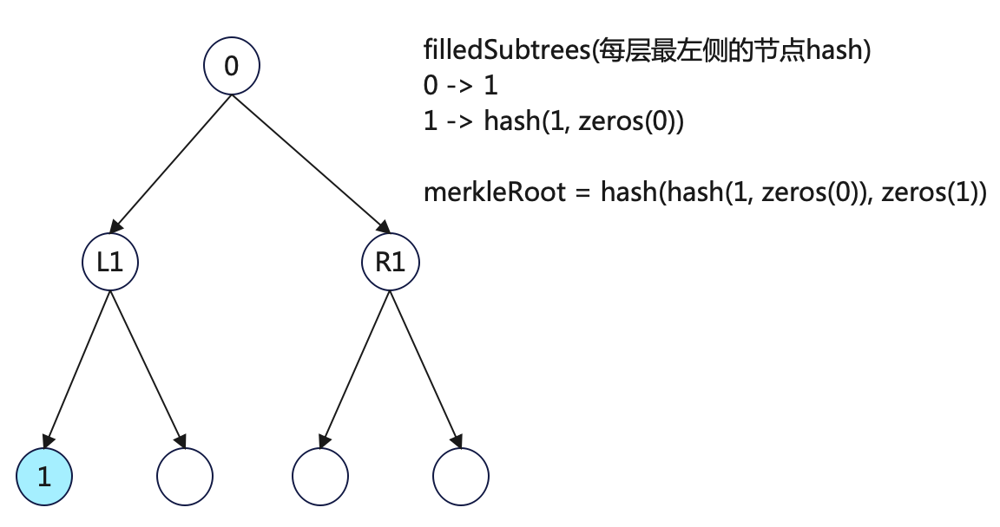
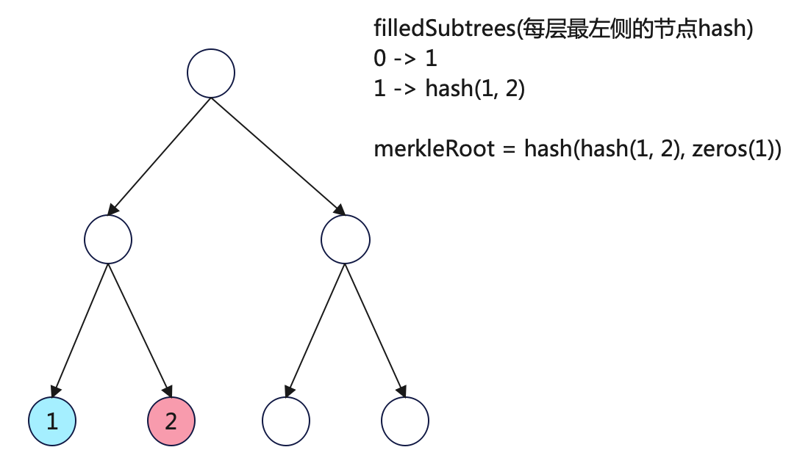
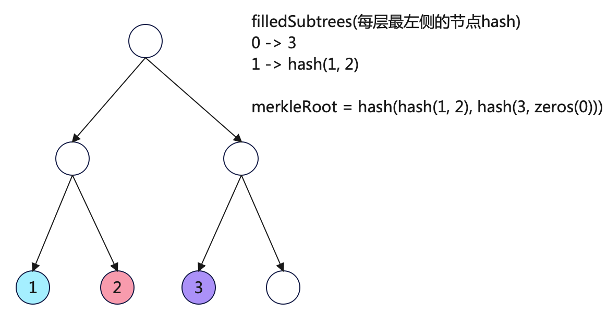
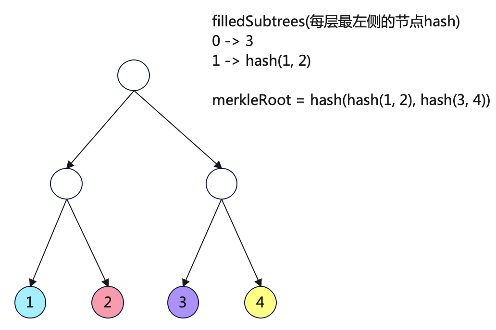

# 背景

- 作为经典的隐私交易服务， tornadoCash使用了merkleTree结构来存储各个deposit行为对应的leaf（或commitment）
- 为了不暴露withdraw行为和deposit操作的对应关系，tornadoCash合约会验证withdraw提交的leaf是否确实在合约中存在
  
  - 如果使用常规的for-loop操作实现，会消耗大量的gas count，导致交易几乎不可行
- tornadoCash支持2^20笔deposit, 哪怕通过merkleTree

## 为什么要使用merkleTree来存储用户的存款行为(deposit commitment)

- 在取款时，withdrawer需要提供proof，证明其取款行为能和之前的某个存款行为对应
  - 不需要明确说明对应哪个存款行为，否则会暴露depositor和withdrawer的关联
  - 需要在zero knowledge proof中进行计算证明，避免外部观测产生关联
- 如果使用常规的for-loop操作实现，会消耗大量的gas count并远远超过evm能支撑的上限，导致交易几乎不可行

## 为什么要使用incrementalMerkleTree

- 即使实现方式从for-loop切换到merkleTree, 但是一旦存款行为（节点数量）增加，大量的节点间计算仍然会消耗大量资源，交易仍然不可行
  - 只是不可行的程度比for-loop好了很多

## incrementalMerkleTree特点

### leaf节点从左往右依次插入（incremental)

- 插入leaf的行为，就是相当于把该leafIndex上的值替换为新插入leaf的值（如hash）

### 高度固定

- 高度固定后，计算量也能固定，对zk友好。
- 高度固定后，不容易被外部观测者进行分析关联

### 空节点值固定填充

- 可以提前计算高度为[0, levels-1]的全0子树的merkleRoot值（zeros结构）

### leaf节点只插入不删除

- 外部可以通过取款成功，对于leaf节点的删除行为进行分析，进而发现和对应depositor的关联

### 新leaf的左右节点值可优化

由于在incrementalMerkleTree中的叶子节点始终从左往右顺序插入:

- 新插入leaf的右侧均为未使用的叶子，可以通过预计算直接生成每个高度下的全0树merkleRoot(zeros结构)，减少计算量
- 新插入leaf的左侧均为已使用的叶子，可以通过缓存每个高度下的左值数据(filledSubtress结构），减少计算量

# 算法说明

核心思路就是缓存(已使用的叶子)和预计算（未使用的叶子，全0树）。

# 算法代码

# 示例场景

- 假设有一个深度为2(levels=2 实际高度为3), 总共4个leaf的incremental merkle tree
- 演示从左到右，每个leaf添加后 tree 的变化

## 初始状态

所有节点均为zeros

## 插入第一个leaf（蓝色叶子, hash = 1）

### 过程说明

#### 第一轮for，i = 0(增加方向为从leaf 到 root)

currentIndex = nextIndex = 0

进入偶数逻辑
left = currentHash = 1
right = zeros(0) = 深度为0的全0树merkleRoot
filledSubtrees[0] = currentLevelHash = 1
计算currentHash = hash(1, zeros(0))
currentIndex = currentIndex/2 = 0

#### 第二轮for, i = 1, currentIndex = 0 —— 第一层

仍然进入偶数逻辑
left = currentHash = hash(1, zeros(0))
right = zeros(1)  = 深度为1的全0树merkleRoot
filledSubtrees[1] = currentLevelHash = hash(1, zeros(0))
计算currentHash = hash(hash(1, zeros(0)), zeros(1)) = **merkleRoot**

#### 无第三轮

### 数据变更（关注filledSubtrees)

filledSubtrees[1]始终代表最大左子树的merkleRoot

## 插入第二个leaf（红色叶子，hash = 2）

### 过程说明

currentIndex = nextIndex = 1

#### 第一轮for，i = 0(增加方向为从leaf 到 root)——第二层

进入奇数逻辑
left = filledSubtrees[0] = 1
right = currentHash = 2
计算currentHash = hash(1, 2)
currentIndex = currentIndex/2 = 0

#### 第二轮for, i = 1, currentIndex = 0 —— 第一层（仍然是左侧节点）

进入偶数逻辑
left = currentHash = hash(1, 2)
right = zeros(1)  = 深度为1的全0树merkleRoot
filledSubtrees[1] = currentLevelHash = hash(1, 2)
计算currentHash = hash(hash(1, 2), zeros(1))
currentIndex = currentIndex / 2 = 0

#### 无第三轮

### 数据变更（关注filledSubtrees)

## 插入第三个leaf（紫色叶子，hash = 3）

currentIndex = nextIndex = 2

#### 第一轮for，i = 0(增加方向为从leaf 到 root)——第二层

进入偶数逻辑
left = currentHash   ( = 3)
right = zeros(0) = 深度为0的全0树merkleRoot
filledSubtrees[0] = currentLevelHash = 3
计算currentHash = hash(3, zeros(0))
currentIndex = currentIndex/2 = 1

#### 第二轮for, i = 1, currentIndex = 1 —— 第一层（是右侧节点）

进入奇数逻辑
left = filledSubtrees[0] = hash(1, 2)
right = currentLevelHash = hash(3, zeros(0))
计算currentHash = hash(hash(1, 2), hash(3, zeros(0)))
currentIndex = currentIndex / 2 = 0

#### 无第三轮

### 数据变更（关注filledSubtrees)

## 插入第四个leaf（黄色叶子，hash = 4）

currentIndex = nextIndex = 3

#### 第一轮for，i = 0(增加方向为从leaf 到 root)——第二层

进入奇数逻辑
left = filledSubtrees[0] = 3
right = currentHash = 4
计算currentHash = hash(3, 4)
currentIndex = currentIndex/2 = 1

#### 第二轮for, i = 1, currentIndex = 1 —— 第一层（是右侧节点）

进入奇数逻辑
left = filledSubtrees[1] = hash(1, 2)
right = currentHash = hash(3, 4)
计算currentHash = hash(hash(1, 2), hash(3, 4))
currentIndex = currentIndex / 2 = 0

#### 无第三轮

### 数据变更（关注filledSubtrees)

## 结论

可以看出，在tornadoCash的incrementalMerkleTree算法实现中，随着新leaf的插入，merkleRoot的计算始终只需要很少的，有限次的计算量。

# 参考文档

[how does tornado cash work](https://www.rareskills.io/post/how-does-tornado-cash-work )

