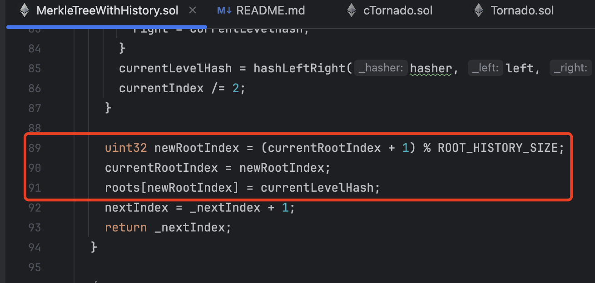
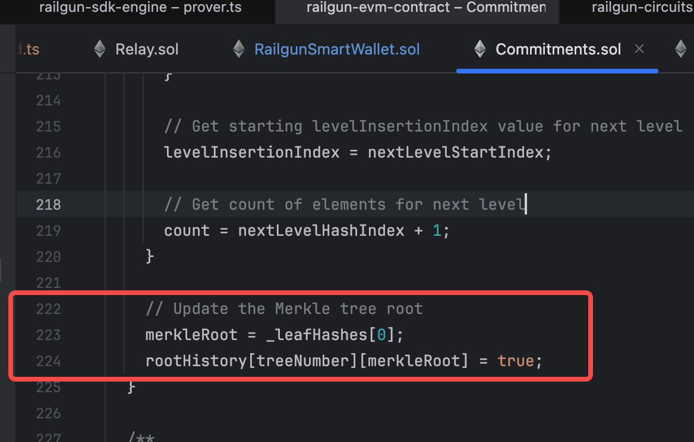
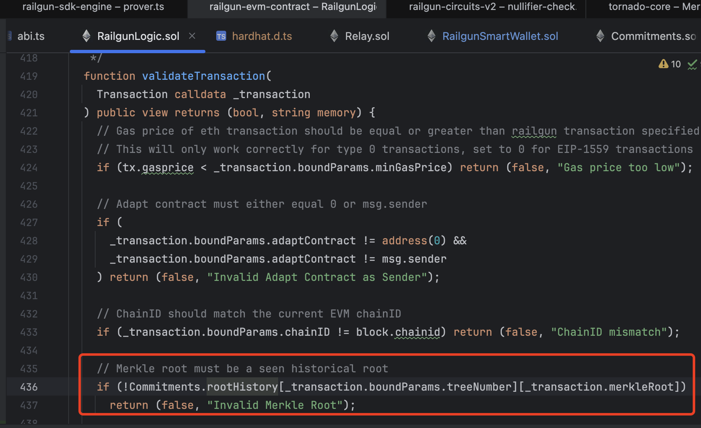

# 背景

- 在railgun privacy和tornado cash中，所有的资金实际上存储在某一个特定的合约中。
- 那么用户在进行并发存款和取款时，是否有并发要求或者其他时间要求，比如A和B同时存款或者取款，存取款操作是否会因为超时失败等。

# 结论
- 对于存款操作
  - railgun privacy和tornado cash均不存在并发要求。
  - 即使A和B同时存款，也不影响各自资产的正确性
- 对于取款操作
  - tornado cash仅缓存最终100个merkleRoot，即在生成取款证明后需要尽快提交交易，否则会因为链上状态变更过大导致取款证明失效，进而导致操作失败。
    - 失败后重新根据链上最新的merkleRoot生成证明并提交即可。
  - railgun privacy对于取款操作无任何并发或者时间要求

# 存款

存款时的主要要求，就是在交易中给出叶子的commitmentHash，以及跟随交易给出对应的资金

## 存款的重点参数要求

- 交易中携带资金
- 交易中携带的资金类型和数量，需要和参数中给出的资金匹配（railgun privacy）
- 交易中需要携带使用commitmentHash（leaf）

## 存款的并发问题

- 从参数要求来说，在tornadoCash和railgun privacy中，对存款行为没有并发限制
- 新leaf会从左到右按交易实际到达的时序插入merkleTree作为叶子

# 取款

- 取款时的主要要求，就是通过zero knowledge proof证明几个重点内容

## 取款的重点参数要求

- 通过zk证明以下3个重点关系
  - 某个leaf确实在merkleTree中
    - 生成merkleProof（通过当前leaf能构造出链上最新的merkleRoot）
    - 由于数据公开，链上任意一个人都能根据已有的leaf数据生成出对应的proof
  - withdrawer知道某个leaf的preimage
    - 在tornado cash中，由于只有depositor有对应的(secret + nullifier), 所以能保证安全性。
    - 在railgun privacy中，由于交易双方都能知道这个leaf的preimage， 所以交易的双方都能构造这个preimage，此时还需要进一步的zkp验证才能保证安全性。（sender可能伪造交易）
  - 使用这个utxo资金的地址确实是该utxo的receiver——仅railgun privacy使用
    - 在railgun privacy中，会在zkp中进一步通过eddsa签名验证该utxo的receiver的签名，确保只有该utxo的receiver才能使用这个utxo，从而保证安全性
    - 跟btc的receiver地址校验思路类似

## 取款的并发问题

- 从参数要求来说，这里有一个可能的并发问题，A和B同时基于某个链上最新的merkleRoot生成自己的取款证明。
- 如果A的交易先提交上链，更新了链上合约的merkleTree，merkleRoot就会发生改变
- merkleTree发生改变之后，B的交易可能会失败（链上最新的merkleRoot因为A的交易已经改变）

### tornadoCash系统中，对于短期内merkleRoot的缓存

##### 结论

tornadoCash合约会缓存最近100个merkleRoot数值，有一定并发限制。

#### 详情

- 在tornadoCash系统中，会在每次存款行为（leaf插入）之后，生成新的merkleRoot数值
  
  - 将merkleRoot数值填入一个固定长度的循环队列进行缓存
  - 记录当前最新的merkleRoot的index（在循环队列中）
  - 当取款操作到达合约时，会校验该操作携带的merkleRoot是否命中缓存。
- 代码示例
  
  - 在新插入leaf之后，记录当前的merkleRoot
    
  - 在每次取款操作时，校验使用的merkleRoot是否命中历史所有的缓存
    
  
  ### railgun privacy系统中，对于历史merkleRoot的缓存
  
  #### 结论

railgun privacy合约会缓存所有的merkleRoot数值

#### 详情

- 在新插入leaf之后，记录当前的merkleRoot
  
- 在每次取款操作时，校验使用的merkleRoot是否命中历史所有的缓存。只要交易上链时，请求中携带的merkleRoot数值仍然还在缓存中，就不会失败。
  
  

# railgun privacy的取款（交易）操作容易混淆的点

- 在railgun privacy系统中，大部分的取款操作实际上隐含的包括了对receiver的“存款”操作
  - 那么在A和B并发“private transact”的过程中，后到达的B的操作是否可能也因为merkleRoot更新出现并发问题导致失败？
  - 实际上不会，仅取款行为会依赖merkleRoot，但是存款行为和前述一样，没有限制。

