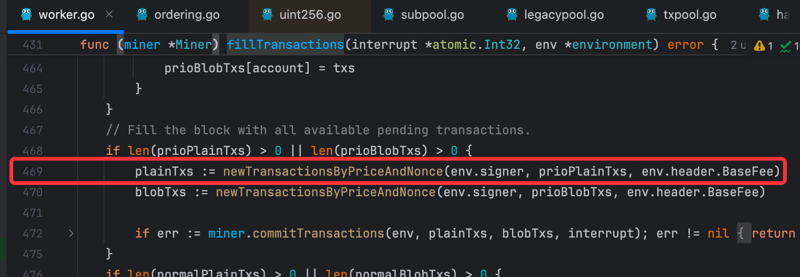
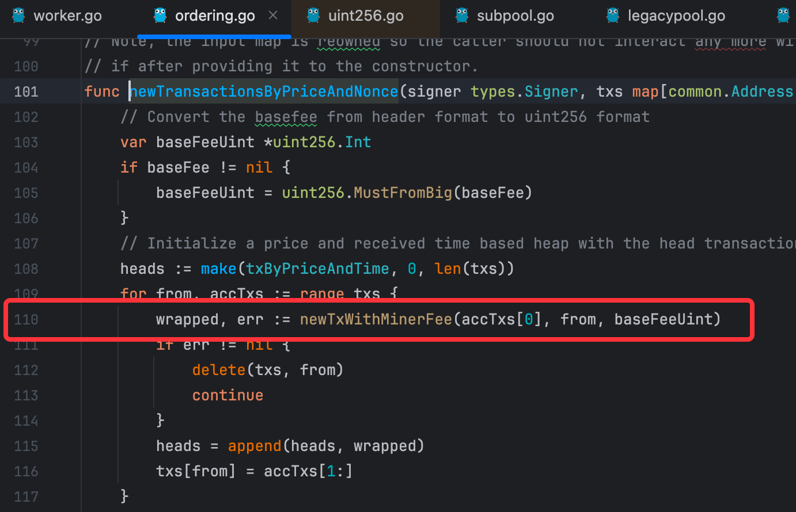

# 背景
- 在eip1559交易中，交易的gasPrice被拆分为3个部分
  - baseFee: 
    - 由evm控制，在网络拥堵和繁忙是根据parent block交易的gas limit使用比例来动态调整
  - maxFeePerGas(gasFeeCap): 
    - 由用户控制，指定该交易的最大可用gasFeeCount
  - maxPriorityFee(gasTipCap): 
    - 由用户控制，指定该交易中，矿工可以得到的最大gasTipCapCount

# 重点问题
- 在这个模型中，用户的gasTipCap消耗，究竟是[0, gasTipCap], 还是说只允许矿工获取固定gasTipCap的gas费用

# 结论（前置）
- 通过geth源代码梳理，确定gasTipCap的使用是代表的“最大”，即[0, gasTipCap]都可能。
- 在中文翻译的语境中，可能带来了一些混淆，英文原版易于理解。

---
# 待验证的场景
- 给定交易, maxFee = 100, gasTipCap = 20, 让交易在baseFee = 90的时候提交，确认交易结果
  - 交易能否被打包上链，比如矿工实际收取10的gasTipCap？
  - 还是交易会被拒绝，因为矿工只能收取20整个的gasTipCap？
- 部分资料支持前者，部分资料支持后者，网络上目前两种说法都有

# 验证方式
- 在公链上发出交易验证（evm主网，sepolia测试网络）
  - 验证场景较为苛刻，很难复现
- (selected)coding阅读源码
  - 
- 自己部署并模拟本地evm节点，进行交易提交验证和源码调试
  - 操作较为复杂，可以作为备选

# geth源码逻辑

## 交易费用计算时机（在打包交易进入区块时） 
- baseFee已确定，打包交易到block的时候，会对交易再次进行排序

## 代码流程
### 打包交易进入区块
- worker.fillTransactions()
- 
### 根据gasFee和nonce对交易进行排序
- ordering.newTransactionsByPriceAndNonce()
- 
### 确定实际的gasTipCap消耗
- ordering.newTxWithMinerFee()
- 
- 这里明确可以看出
  - 当baseFee > gasFeeCap的时候, 交易不会被打包
  - **tip = min(gasFeeCap - baseFee, gasTipCap)**
