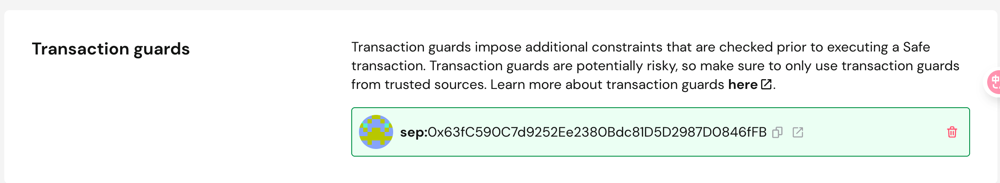
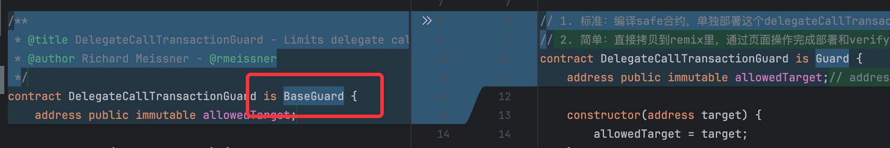
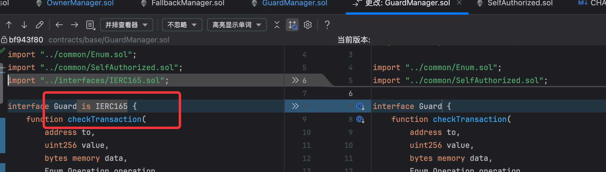
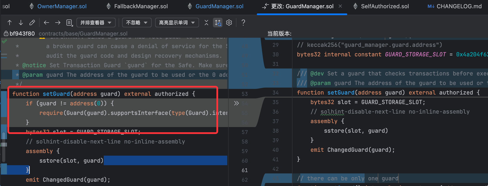

# 背景
- safe1.3.0版本和safe1.4.1版本（当前时点webUI创建出来的safe版本）对于guard模块接口要求有变更，需要更新
- 通过safe的web2部署一个最新的guard模块到safe1.4.1版本上

# 结论
- safe1.3.0版本和1.4.1版本需要绑定不同的guard合约，否则会报错。
  - 昨天的交易不是safe的限制，而是guard模块版本和safe的版本不匹配导致
    - safe合约版本是1.4.1, 而本地的safe代码和模板guard模块是1.3.0版本
  - 强行提交会报错，可以看到原因是guard合约没有实现新版本eip165的接口要求 
    - 0x76fc3c4698c1cbfe36948682569329fc8afed3e29d4de58033435ce43ff0337d
- 可以通过safe的web2页面手动绑定guard模块
  - 手动验证完毕

# 效果图

# 分析
## safe合约1.3.0版本到1.4.1版本的guard模块相关变更
- guard合约定义变更
  - 
- safe逻辑中对于guard模块的调用(GuardManager.setGuard方法)
  - 
  - 
- 可以看出，主要是在setGuard方法里新增了erc165的接口验证
  - 导致1.3.0版本的guard模版无法被绑定到1.4.1版本的safe合约上

# 操作步骤
## 部署guard合约到链上
- 方案1: 在remix推送简单的guard合约到链上并verify
  - [简单的guard合约代码](./src/contracts/SafeDelegateCallGuard_1_4_1.sol)
  - sepolia address: 0x63fC590C7d9252Ee2380Bdc81D5D2987D0846fFB
- 方案2: 编译，发布，verify safe 1.4.1版本仓库里的guard合约
  - 

## 使用safe的web2UI绑定该guard合约
- new Transaction
- contract interaction builder
- paste this current safe account address
- choose "USE IMPLEMENTATION ABI"
- choose function "SetGuard"
- paste the guard address we've just deployed
- build and send batch

## 验证
- 强行提交delegateCall的交易，会被guard模块自动阻止
