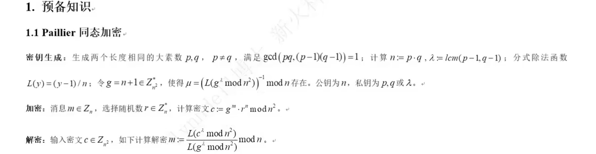
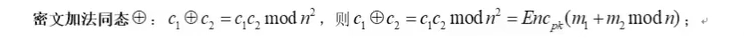
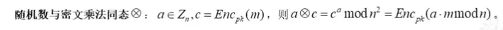
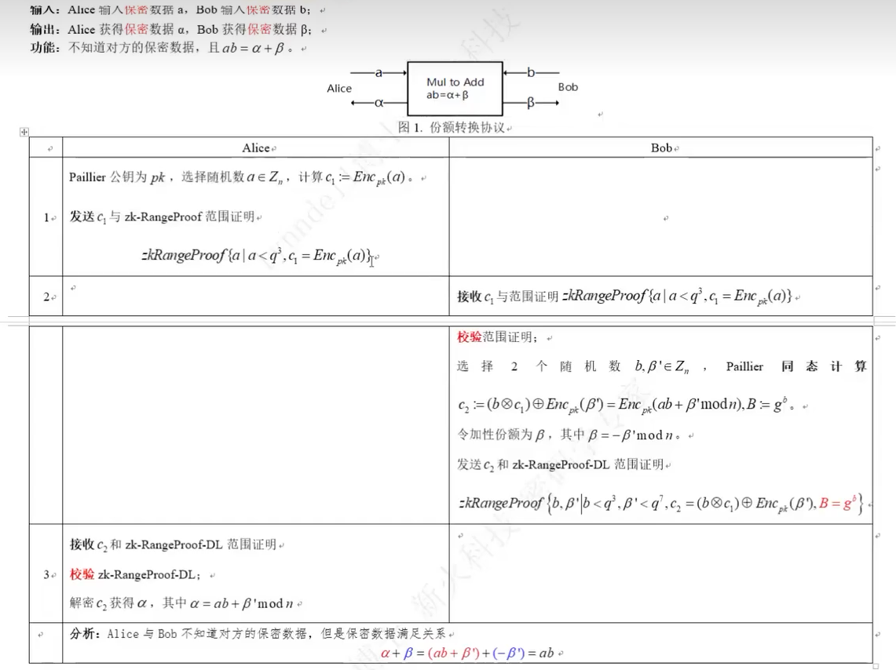

# 背景
- 之前通过lyndell老师的视频入门了gg18的算法，有了整体上，入门级的理解
- 希望再过一遍lyndell老师的视频，深化相关技术的理解
- 仍然还有很多密码学的地方似懂非懂，但是逐步深入

# 视频链接
【密码学系列课程6 GG18门限签名-p1】 https://www.bilibili.com/video/BV1ds4y1c7Xa/?share_source=copy_web&vd_source=ddf35a2beeb153b9285efc6e3973cf05

# gg18算法中的重点密码学概念

## paillier同态加密
- 
- 大素数p，q
- 密文计算输入

### 简单的，同态乘法,加法推导
- encPK(x)方法即为对x进行同态加密 
  - 简单理解为g^x就行
- 加法同态 ⊕ （密文 + 密文）
  - 
  - 重点是在于直接把2个密文c1和c2相乘，相当于就是，底数相同指数相加
    - c1 = encPK(m1)
    - c2 = encPK(m2)
    - 所以c1 ⊕ c2 = c1 * c2 = g^m1 * g^m2 = g^(m1 + m2) = EncPK(m1 + m2 mod n)
- 乘法同态 ⊗（随机数 * 密文）
  - 
  - 重点在于直接把随机数作为指数和密文进行运算
    - c = encPK(m) 
    - 所以 a ⊗ c = c^a = (g^m)^a = g^(am) = encPK(a * m mod n) 

## mta协议
- 乘法转加法协议，还是先看老师的图
  - 重点的理解
    - Alice 输入秘密a, Bob输入秘密b
    - Alice 得到秘密⍺， Bob得到秘密β
  - mta是个协议，比较抽象，可以有很多个算法来实现
    - paillier只是其中之一的实现，并且不一定是最优的算法
  - 