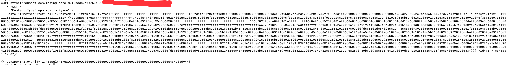
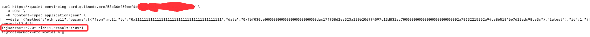
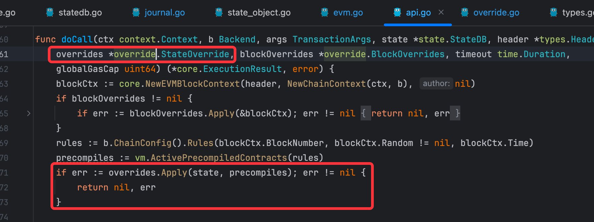
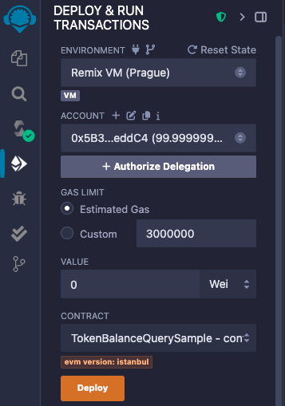
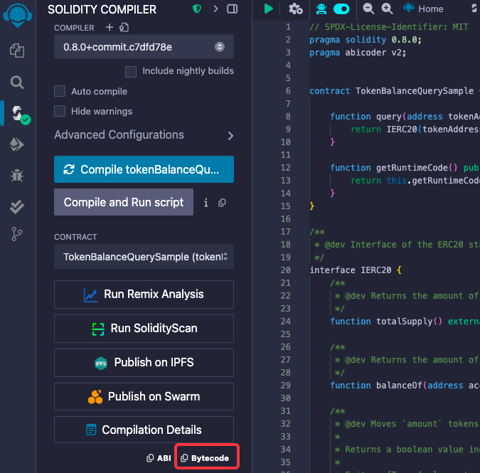
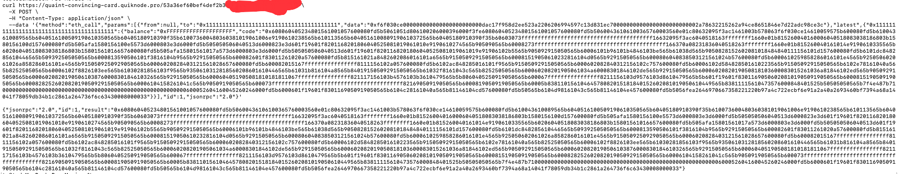
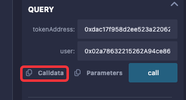
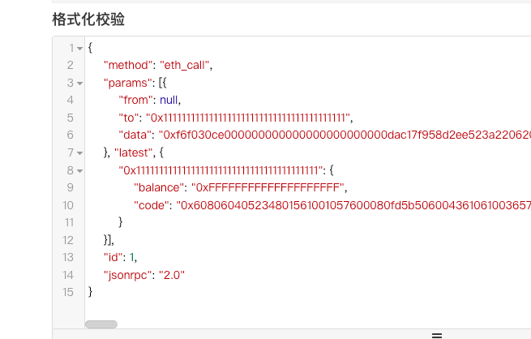

# 背景
- 结合近期分享的多个视频中关于eth_call的实现原理的理解，部分实现携带自定义合约数据重写的交易模拟
# 场景构造
- 场景1
  - 通过一个简单合约查询某个特定地址的token(如usdt)余额，但不实际部署这个简单合约
  - 原理：重写特定地址的runtimeCode
- 场景2（本次分享不涉及）
  - 通过重写safe owner和签名阈值，在交易签名前执行交易模拟
  - 原理：重写特定地址的storage slot的数值
# 结论
- 通过携带自定义数据重写的交易模拟功能实现，可以完成预定目标。
- 目前仅部分rpc provider支持完整的eth_call功能，如quickNode
### 携带自定义数据重写的交易模拟可以查询得到特定地址的usdt token余额
- 
### 不携带自定义数据重写的交易模拟无法实现该功能（没有实际部署合约）
- 

# 原理 
- geth中的eth_call方法功能支持携带自定义的stateOverrides
- 

# 步骤
## remix上编译代码并部署到虚拟环境
- 

## 复制该合约部署时的callCode
- 注意红框里的code是部署合约时的交易，该交易的返回值才是合约的runtimeCode
- 

## 获取合约实际的runtimeCode
- 通过eth_call模拟执行该合约的callCode
  
- 
## 在remix中进行模拟调用，获取对应的方法callData(也可以自己手动或者代码构造)
- 获取ethereum上usdt合约地址
  - 0xdac17f958d2ee523a2206206994597c13d831ec7
- 找一个ethereum上有USDT的地址
  - 0x02a78632215262A94ce8651846e7D22ADc98Ce3C
- 填入到remix，并复制remix里的callData
  - 
## 构造交易模拟的参数
- 选定特定地址0x1111， 构造runtimeCode的重写，同时给定callData
- 
- 
## 获取结果（执行curl信令），完毕

# 相关资源
## geth源代码解读系列视频
- eth_call实现原理 [250611【geth源码阅读】eth_call实现原理4 处理slot数据重写和safeTx模拟](https://www.bilibili.com/video/BV1shTrzZEFK/?share_source=copy_web&vd_source=ce0cad875b0b4c2a4efa014c699df898)
## 演示用到的代码
- [余额查询合约](./src/contracts/TokenBalanceQuerySample.sol)
## 用于验证的url（目前quickNode的rpcUrl支持此类用法）
- （有效）携带自定义stateOverrides 
```
- curl https://quaint-convincing-card.quiknode.pro/${替换成你自己的url}/ \
  -X POST \
  -H "Content-Type: application/json" \
  --data '{"method":"eth_call","params":[{"from":null,"to":"0x1111111111111111111111111111111111111111","data":"0xf6f030ce000000000000000000000000dac17f958d2ee523a2206206994597c13d831ec700000000000000000000000002a78632215262a94ce8651846e7d22adc98ce3c"},"latest",{"0x1111111111111111111111111111111111111111":{"balance":"0xFFFFFFFFFFFFFFFFFFFF","code":"0x608060405234801561001057600080fd5b50600436106100365760003560e01c80632095f3ac1461003b578063f6f030ce14610059575b600080fd5b610043610089565b6040516100509190610350565b60405180910390f35b610073600480360381019061006e9190610238565b610113565b6040516100809190610372565b60405180910390f35b60603073ffffffffffffffffffffffffffffffffffffffff16632095f3ac6040518163ffffffff1660e01b815260040160006040518083038186803b1580156100d157600080fd5b505afa1580156100e5573d6000803e3d6000fd5b505050506040513d6000823e3d601f19601f8201168201806040525081019061010e9190610274565b905090565b60008273ffffffffffffffffffffffffffffffffffffffff166370a08231836040518263ffffffff1660e01b815260040161014e9190610335565b60206040518083038186803b15801561016657600080fd5b505afa15801561017a573d6000803e3d6000fd5b505050506040513d601f19601f8201168201806040525081019061019e91906102b5565b905092915050565b60006101b96101b4846103be565b61038d565b9050828152602081018484840111156101d157600080fd5b6101dc848285610446565b509392505050565b6000813590506101f3816104b9565b92915050565b600082601f83011261020a57600080fd5b815161021a8482602086016101a6565b91505092915050565b600081519050610232816104d0565b92915050565b6000806040838503121561024b57600080fd5b6000610259858286016101e4565b925050602061026a858286016101e4565b9150509250929050565b60006020828403121561028657600080fd5b600082015167ffffffffffffffff8111156102a057600080fd5b6102ac848285016101f9565b91505092915050565b6000602082840312156102c757600080fd5b60006102d584828501610223565b91505092915050565b6102e78161040a565b82525050565b60006102f8826103ee565b61030281856103f9565b9350610312818560208601610446565b61031b816104a8565b840191505092915050565b61032f8161043c565b82525050565b600060208201905061034a60008301846102de565b92915050565b6000602082019050818103600083015261036a81846102ed565b905092915050565b60006020820190506103876000830184610326565b92915050565b6000604051905081810181811067ffffffffffffffff821117156103b4576103b3610479565b5b8060405250919050565b600067ffffffffffffffff8211156103d9576103d8610479565b5b601f19601f8301169050602081019050919050565b600081519050919050565b600082825260208201905092915050565b60006104158261041c565b9050919050565b600073ffffffffffffffffffffffffffffffffffffffff82169050919050565b6000819050919050565b60005b83811015610464578082015181840152602081019050610449565b83811115610473576000848401525b50505050565b7f4e487b7100000000000000000000000000000000000000000000000000000000600052604160045260246000fd5b6000601f19601f8301169050919050565b6104c28161040a565b81146104cd57600080fd5b50565b6104d98161043c565b81146104e457600080fd5b5056fea2646970667358221220b97a4c722ecbf6e91a2a40a2693460bf7394a68a14041f78059db34b1c2861a264736f6c63430008000033"}}],"id":1,"jsonrpc":"2.0"}'
```
- （无效）不携带自定义stateOverrides
```
- curl https://quaint-convincing-card.quiknode.pro/${替换成你自己的url}/ \
  -X POST \
  -H "Content-Type: application/json" \
  --data '{"method":"eth_call","params":[{"from":null,"to":"0x1111111111111111111111111111111111111111","data":"0xf6f030ce000000000000000000000000dac17f958d2ee523a2206206994597c13d831ec700000000000000000000000002a78632215262a94ce8651846e7d22adc98ce3c"},"latest"],"id":1,"jsonrpc":"2.0"}'
```