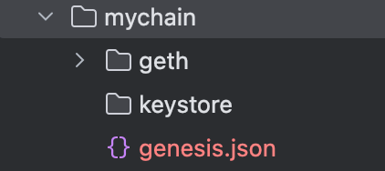
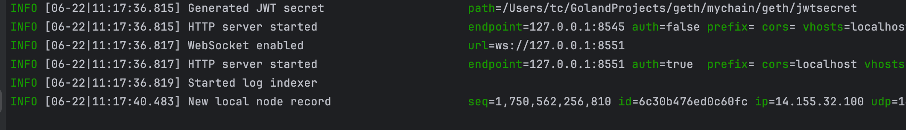
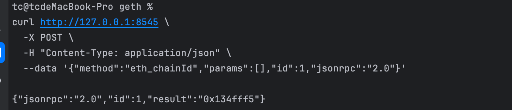

# 背景
前几期视频分享了geth源码的阅读，理解了eth_call的实现原理。确认了几个点：
- eth_call实现代码里已经支持了storageOverrides结构，可以传入自定义storage slot数据
- eth_call的返回值不包括交易模拟结束后的storage slot变更，需要新增方法eth_tcSimulation和对应代码来完成功能
- 当前git position
  - branch: master
  - revisionNumber: 2a1784baef0e9d0c0641bc97d1a3478048de5c23

# 目的
- 私有化部署geth节点用于模拟验证
- 源码调试geth节点用于新增功能调试

# 私有化部署geth节点步骤

## 配置的原则
- 只测试evm相关功能，不需要启动并配置beacon节点
  - 不验证共识相关功能
- 不使用--dev等配置 模拟测试出块
  - 确保和生产场景完全一致
- 模拟prague fork之后的交易表现
- 
## 准备genesis.json创世配置
- 完整配置
  - [genesis.json](./src/genesis.json)
- 设置要点
  - 设置difficulty标记, 代表post merge
  - 设置config中各个fork的block和timestamp都为0（即为支持该fork功能）

## 编译geth节点
```
make geth 
```

## 创建datadir并配置genesis.json
- 创建目录和配置
```
mkdir mychain && vim ./mychain/genesis.json
```
- 写入配置

## 初始化geth节点
- 执行命令
```
./build/bin/geth --datadir ./mychain init ./mychain/genesis.json
```
### init完成后，目录结构

### 过程中可能出现的问题
- 配置项错误导致启动失败，解决对应的配置问题即可
## 启动geth节点
- 执行命令
```
./build/bin/geth --datadir ./mychain --networkid 20250613 --http --http.api "eth,web3,personal,debug,txpool" --allow-insecure-unlock

```
### 启动成功

### 过程中可能出现的问题
- 配置项错误导致启动失败，需要删掉datadir里的geth和keystore目录并重新init

## 测试验证
- 获取chainId
```
curl http://127.0.0.1:8545 \
  -X POST \
  -H "Content-Type: application/json" \
  --data '{"method":"eth_chainId","params":[],"id":1,"jsonrpc":"2.0"}'
```
- 验证结果



# 源码调试步骤
- 将私有化部署geth init好的配置作为datadir,。
- 调试启动的运行参数更新为私有化部署的参数。
- 其余操作均类似