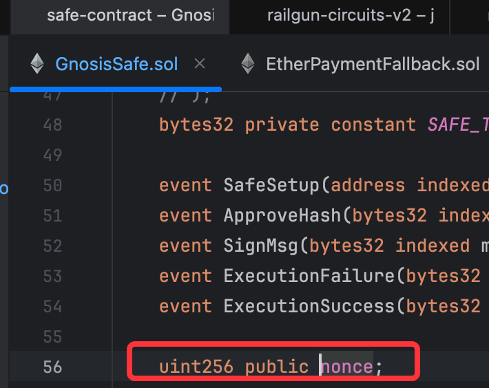
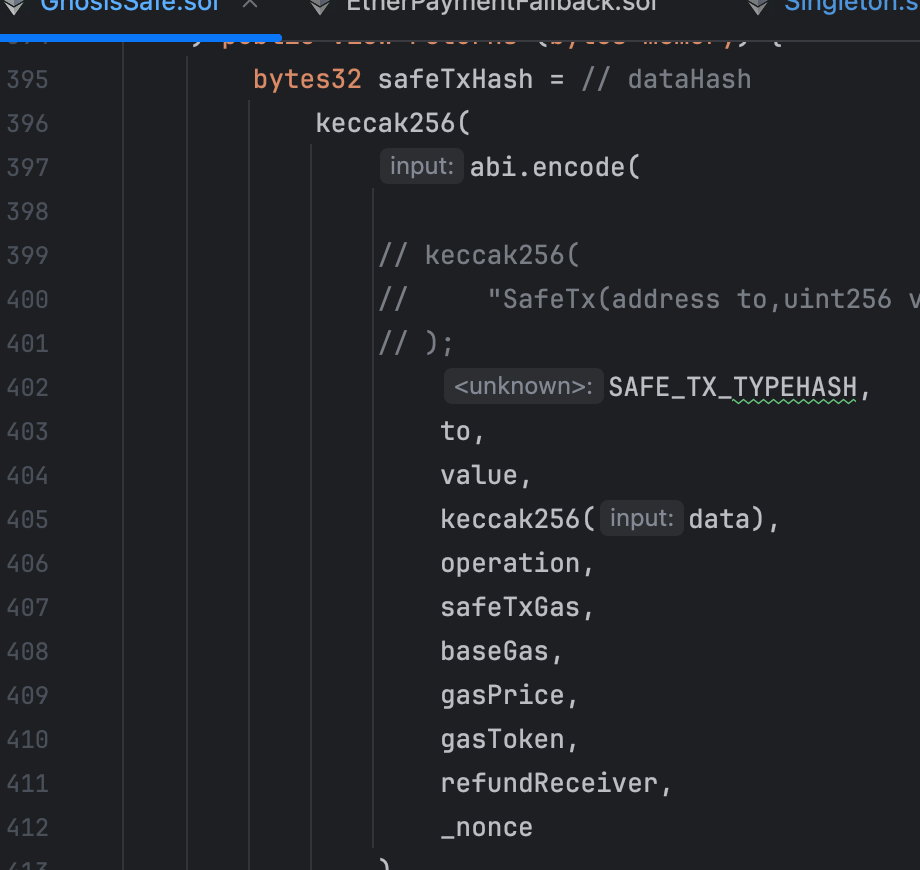
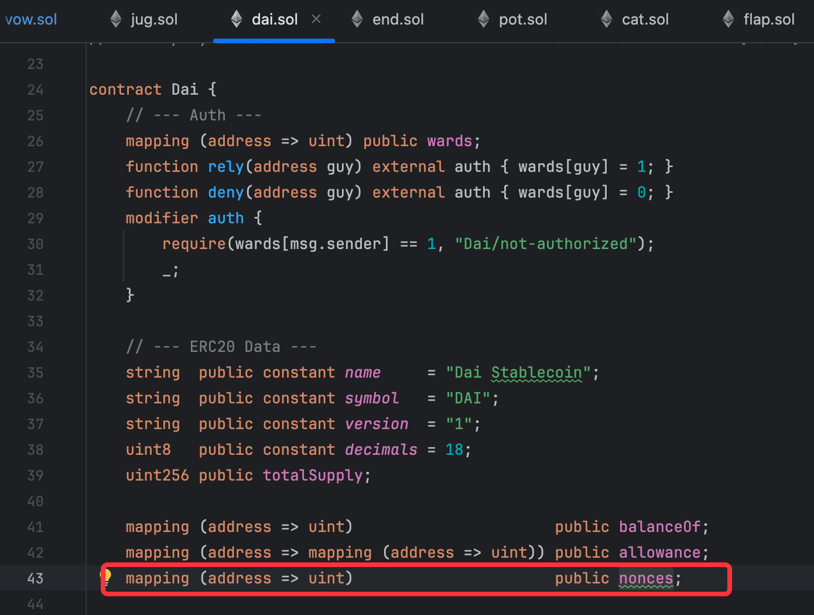
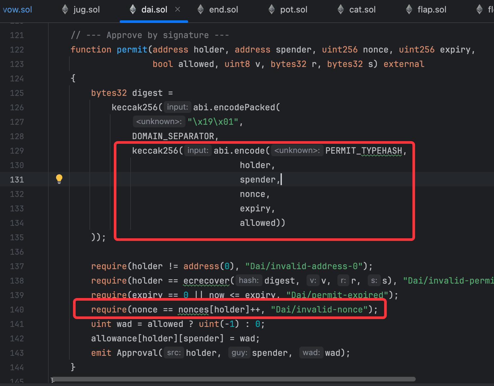
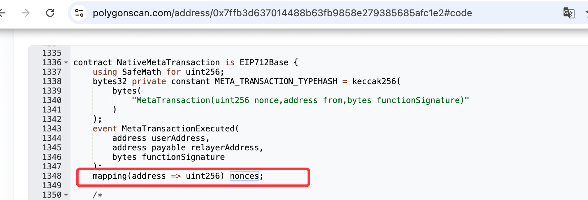
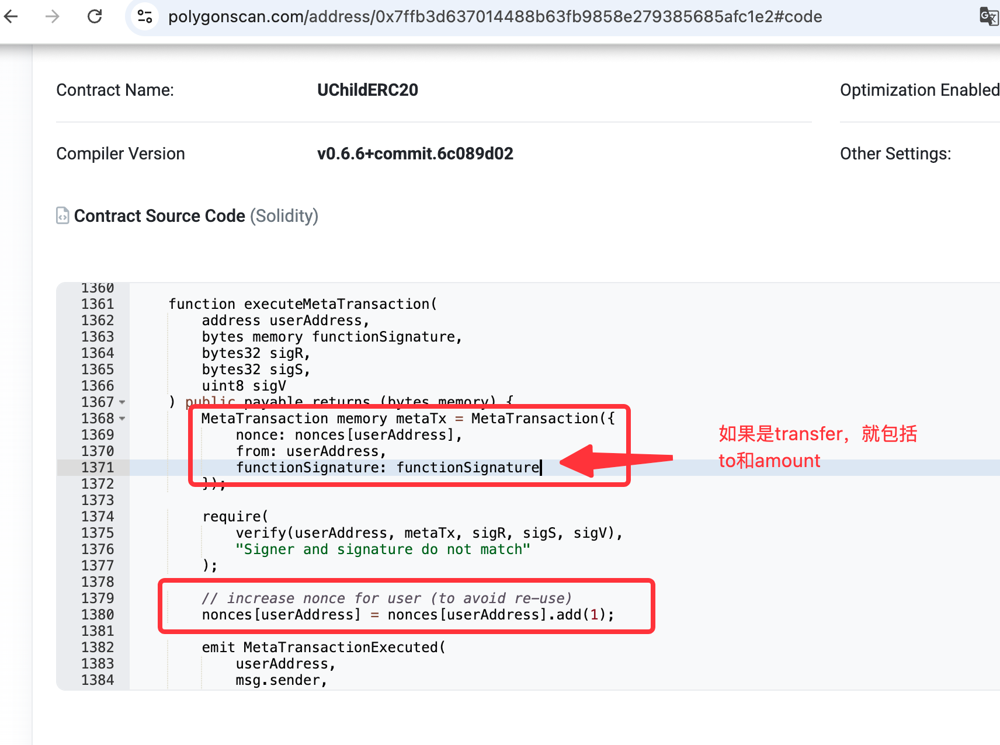
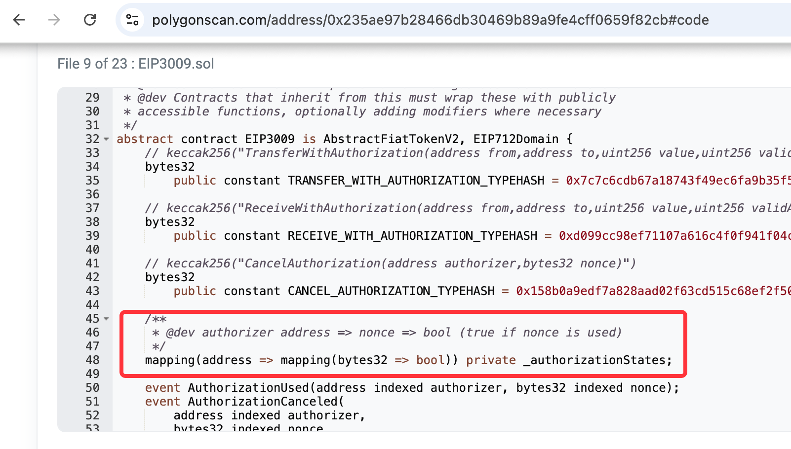
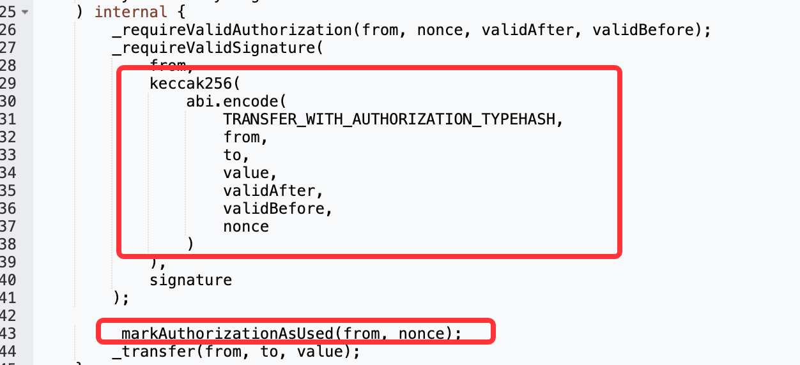
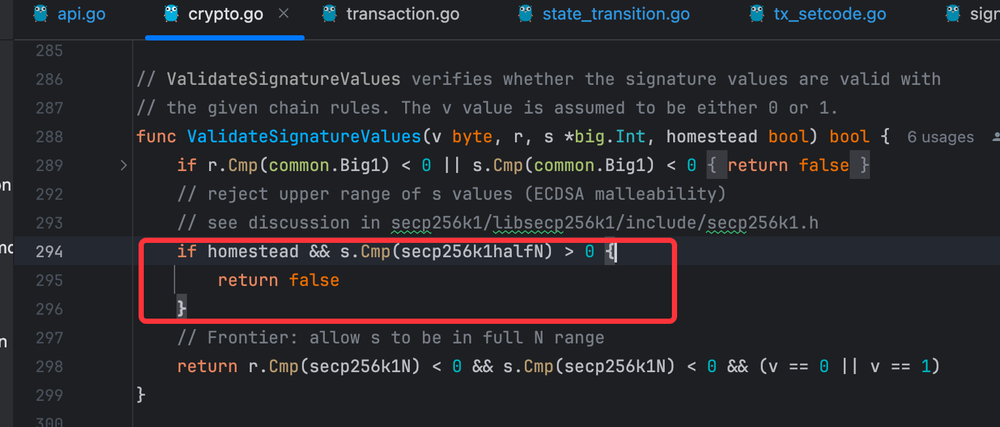

# 背景
- 在evm的solidity合约上，大量的应用了链下签名的验证以提高便利性，缓解gas代付问题，以及安全性问题
- 好处明显，但是如果使用不恰当，也会带来安全风险

# 常见的 链下签名链上验证 场景
- safe的合约钱包的交易权限确认
  - 各个owner链下签名，最后提交到链上进行验证
- 各个token合约的gasless实现，允许fromAddress在没有主币的场景下发起交易
  - eip2612(permit)——approve的gasless替代
    - a offline-sign permit "b get some allowance" -> b submit "transferFrom a to c with amount"
  - eip3009(transferWithAuthorization)——transfer的gasless替代
    - a offline-sign transaction "a transfer to c with amount" -> b submit
- 身份认证
  - 某些功能合约（如地址簿），确认owner有操作权限
  - 
# 链下签名的核心考量
- 算法层面的签名一旦生成就永久有效（任何时候都能通过签名验证）
- 需要合约层面做额外的操作来完善签名的生命周期管理

## 解决思路
- 将签名信息的关键数据和合约层面的额外操作均放入待签名信息的摘要中
- 如 msgToSign = Hash(..., **core factor in operation**, **extra verification method in solidity**, ...)
## chainId
- 避免多链重放, 还是那句话，算法层面的签名一定会通过验证，
  - 思考一个场景，签名的消息不包括chainId，那么你在主链上的同意”签名“，也可以被用来在arbitrum上进行同意，同样能验证通过。
## valid time range
- 限制签名的有效时间周期，缩短潜在攻击者的可用时间窗口

## 要签名的操作**核心信息**
- 避免攻击者通过“抢跑“的方式完成攻击
  - 即使攻击者作为第三方（比如httpRpcProvider）提前获取了你的签名和交易信息，并在你之前将交易上链，也无法篡改交易内容
  - 思考一个场景，签名的消息里只包括from地址（你的账户），其他人获取到你的签名后，将to和amount信息篡改为自己的，即完成攻击
- 如转账操作的from, to, amount, 
  - msgToSign = Hash(from, to, amount)
- 如合约交易的to, amount, calldata, callType(delegatecall or not), fee refund 
  - msgToSign = Hash(to, amount, callData, ...)

## nonce
- 需要将nonce在合约里单独记录存储，并且将nonce信息打包进签名的一部分。
- 避免攻击者通过重放已经验证通过的签名进行恶意攻击
  - 思考一个场景，你转账给张三10USDT，签名信息里包括from, to, amount, 任何人截获这个消息也不能篡改（否则无法通过验证）
    - 但是他可以不停的，无限的调用相同方法恶意消耗你的资金，直到抽干资产。
- 合约里记录nonce的实现思路
  - 自增的nonce（dai, safe, usdt-polygon, ...)
    - 优势：资源消耗低（每个用户仅使用一个uint256值）
    - 劣势：
      - 并发复杂度大，需要控制顺序
      - 从其他公链角度来看（solana, tron), evm中固定自增的nonce并不是一个好的设计 
  - 并发的nonce（usdc-polygon, ...）
    - 优势：并发友好
    - 劣势：资源消耗明显（每个用户使用一个mapping结构存储已经使用过的nonce值）
# 著名合约项目中的对应实现
- safe
- dai
- USDT-Polygon
- USDC-Polygon
- 
# 其他补充
## ECDSA签名的s和n-s问题
- 从之前分享过的mpc算法基础知识可以得到，ecdsa签名包含 r, s
  - 在签名验证时，(r, s)和(r, n - s)都能通过签名验证
  - [【ecdsa私钥签名】学习和理解 ecdsa签名信息的推导和验证 ](https://www.bilibili.com/video/BV1Gd7zzFEZ5/?share_source=copy_web&vd_source=ce0cad875b0b4c2a4efa014c699df898&t=272)
- 如何解决？
### part1: 签名 + 合约层面的实现
- nonce

### part2: 链底层实现
- geth代码中，在homestead版本后，对于签名验证和从地址中恢复签名自动使用小于n/2的值
- 即不再存在s和n-s问题（s和n-s至少有一个小于n/2)
- 可以从eip7702代码中，恢复authorization的from地址代码处看到
- 

### part3: 算法层面
- 使用eddsa签名算法，根本上避免
- 如railgun privacy里对于资产的使用授权是通过eddsa签名进行的验证
- [railgun privacy技术实现原理解析 - spendingKey](https://www.bilibili.com/video/BV1qnVRzeEPo/?share_source=copy_web&vd_source=ce0cad875b0b4c2a4efa014c699df898&t=699)