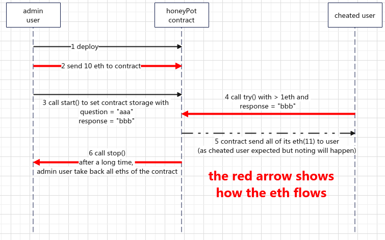
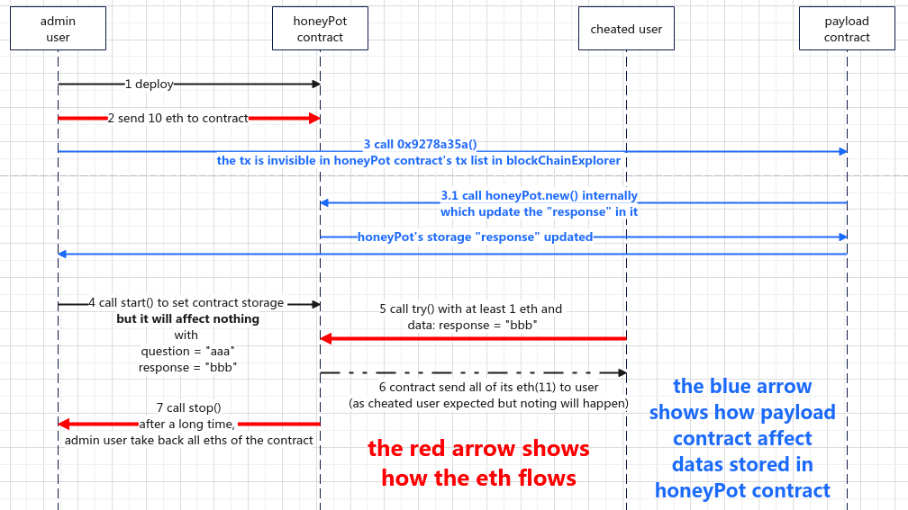
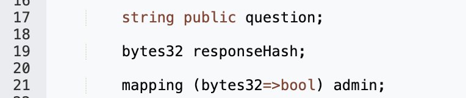
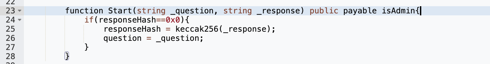
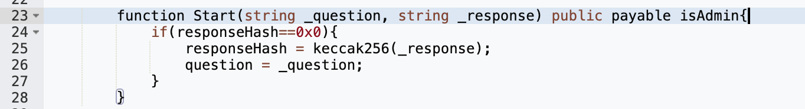
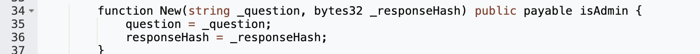
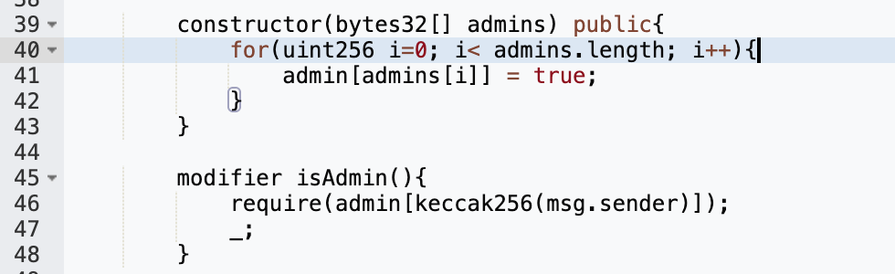
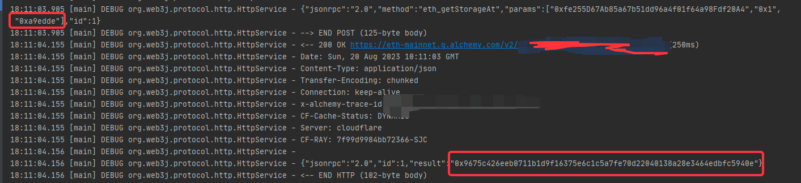
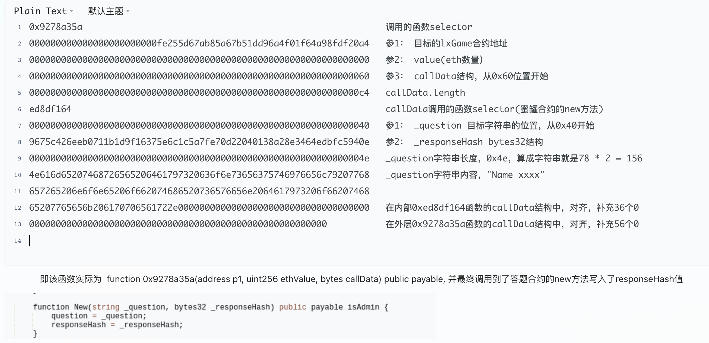
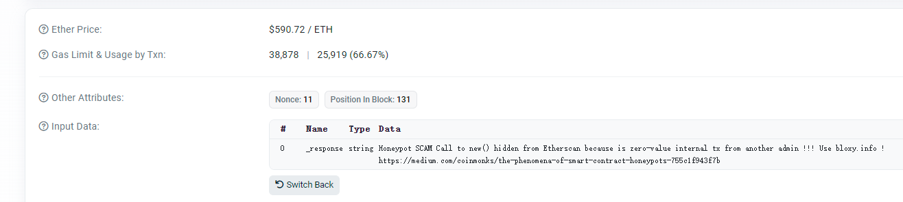

# 背景
- 以太坊上有个经典的蜜罐(honeyPot)骗局，叫“答题(quiz)”合约。
- 相当于骗子在链上部署一个Quiz合约，存入一些eth，
  - 在合约中有一个方法允许所有人调用：
    - 答对了某个问题就可以获取这个合约中的所有eth，
    - 每次答题需要携带1个eth
- 实际上永远不会有人能正确答题并领取到quiz合约中的所有eth

# 目的
- 理解这个骗局如何结合web2 + web3的方式实现，避免被骗。
- web3世界和web2世界没什么区别，很多经典骗术都是来来回回用，一茬一茬的收割新人。

# 结论
- 骗局主要是利用了etherscan等区块链浏览器对内联交易的解析逻辑缺陷
  - etherscan.Transactions: 展示跟目标地址直接相关的交易(tx.from, tx.to)
  - **etherscan.InternalTransactions: 展示跟目标地址相关的，ethValue不为0的内联交易信息**
    - 骗子就是利用这个点进行的操作。
  - etherscan.TokenTransfers: 展示跟目标地址相关的，token转账信息。
    - 可以考虑blocksec, tenderly等区块链浏览器进行细节查看
- 在整个蜜罐构造中，骗子需要部署2个合约，并分别调用方法
  - 部署quiz合约，将owner设置为自己地址的hash以及payload攻击合约地址的hash
  - 部署payload攻击合约，
    - 并调用quiz合约的new方法更新response答案hash
  - 对quiz合约转账eth，并调用start方法设置答案
- 这种蜜罐合约的潜在受害者群体反而是一些web3的熟手，比如对链上最新数据进行监听的人
  - 对未知的东西永远要保有敬畏，深入研究才能少踩坑
  - 避坑思路: 实际查看合约storage，通过tenderly, blocksec等带有交易调试，交易模拟的工具进行分析

# 相关地址
- 经典的quiz合约地址: 0xfe255D67Ab85a67b51dd96a4f01f64a98Fdf20A4
- payload合约地址: 0xF4e96E2D3b4E27853B5eaBc5b0ddcc664F2b1eD1
- 关键的payload交易: 0xa375511d7ead88c924d3568547bdd238ed39605c90c203e12e85c5ea6885e35e

# 请求流数据流梳理
## 请求流（表面上的）

## 请求流（实际的）

## 时间线梳理
- 11136466:
  - 骗子部署quiz合约 
- 11136477
  - 骗子通过payload合约发起搞事情的交易 
- 11136481
  - 骗子调用start()函数在表面上设置 

# honeyPot合约概览
## 存储
- 
- 依次为问题，问题的答案Hash，以及owner列表
  - owner列表里存储的是owner地址的Hash，而不是地址，方便骗子隐藏payload合约地址。
  - 根据hash算法特性，无法从hash倒推出实际的owner地址。
## 重点方法
### try方法
- 受害者们用于答题的方法，所有人可调用
- 可以看到，携带超过1个eth，并且命中response答案的sender就可以获取所有的资金

### start方法
- 骗子在明面上用于更新quiz合约答案的方法，仅owner可调用
- **注意这里，如果responseHash不为0，则不会实际修改**
- 

### new方法
- 骗子通过payload合约，悄悄地更新quiz合约答案的方法，仅owner可调用

## quiz合约构造函数和isAdmin装饰器
- 通过这种验证hash的方式有效的隐藏了实际的owner地址，减少骗术的细节曝光
- 

## payload合约调用后，quiz合约的slot[1]就发生了变化（即responseHash）
- 关键交易：0xa375511d7ead88c924d3568547bdd238ed39605c90c203e12e85c5ea6885e35e
- 
- 
# payload合约反编译

# payload合约关键交易calldata解析

## 其他
### 其他安全爱好者对这个合约地址的告警
- https://etherscan.io/tx/0xf5a744cf53e87251661dbae13bf243bd22144e6056286206deb1a2bcac010219
- 
