# 背景
- 今年的bybit，去年的wazirx交易所的safe钱包均出现了被攻击的事件，导致大量资金丢失
- 理解safe的实现原理，才能更进一步的保护自己的资金安全。

# 攻击原理简述
- safe的owner签署了高危交易，交易完成后，safe合约的impl逻辑合约地址被替换
  - 钱还在这个地址，但是已经不需要多签才能支出了，或者说此时safe合约已经不是safe合约了。

# safe合约架构简图
- 常规的proxy
- 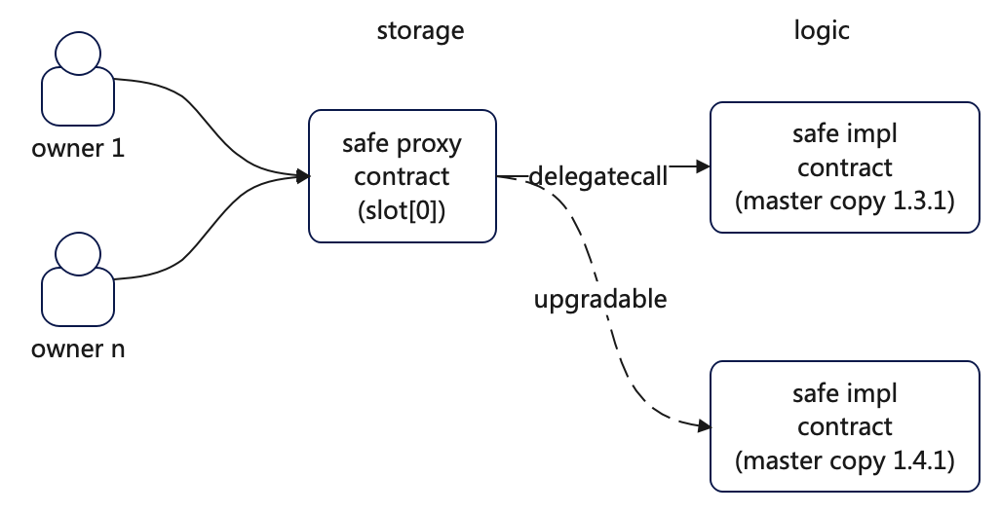
- 
# 防护措施
- 人的层面
  - 利用好web2的流程，做好人的交叉确认，做好设备的交叉确认，
  - 不签署任何不理解的交易，做好交易模拟
    - 灵活使用tenderly,safeUtils等工具，或[修改geth节点提供交易自定义模拟能力](https://www.bilibili.com/video/BV1HdK3zKEuK/?share_source=copy_web&vd_source=ce0cad875b0b4c2a4efa014c699df898&t=1187)
- 事的层面
  - web2: [safe官网](app.safe.global)更新了交易流程，对这种关键的风险交易要求再次确认
    - 仍然存在safe的web2再次被黑的风险
  - web3: 在关键的safe合约上，加载guard模块来进行web3层面的安全防护(之前的几次分享)
    - [guard模块实现原理, 绑定到safe的流程](https://www.bilibili.com/video/BV1z2JHzFE8J/?share_source=copy_web&vd_source=ce0cad875b0b4c2a4efa014c699df898)
    - [guard模块和safe的多版本兼容性分析和处理](https://www.bilibili.com/video/BV1z2JHzFE8J/?share_source=copy_web&vd_source=ce0cad875b0b4c2a4efa014c699df898)

# 攻击复现步骤
## 部署一个safe合约，并指定1/2的owner（方便测试）
- 在safe web页面上构造和部署safe合约
  - 0xfd73fc22e1b64dDe28B8c055FffDC79Be8180F49
- owner列表(1/3)
  - 0x3b2678ee795348e6dccc613e0a7b1811c8a24c26
  - 0xE5a7B0C16127F81530352bdcE6d5a6C7b07db4Ec
- 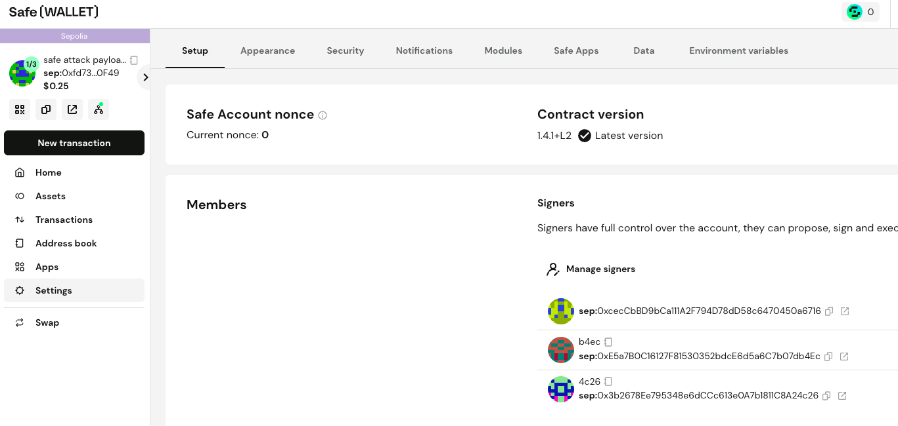

## 转入测试资金（token + coin）
- 888 usdc (mock token)
- 0.0001 eth
- 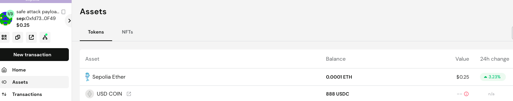

## 部署攻击合约
- [Payload.sol](./evm/src/SafeAttackPayload.sol)
- [payload攻击合约 0xE03aA9F507B91164Cc044A33796f3A5146463a6c](https://sepolia.etherscan.io/address/0xE03aA9F507B91164Cc044A33796f3A5146463a6c#code)
- 
## owner签署风险交易
- 攻击合约交易构造
  - 主要是构造一笔向payload合约delegateCall的safe交易
- 更新slot0，并将slot1设置为黑客的owner地址
  - [链上交易信息](https://sepolia.etherscan.io/tx/0xea737781498a3dd61fe9780fb6a805947e834009e11b486b4f2acee9ff1610d8)
  - 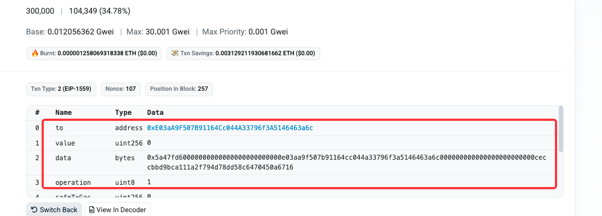
### 交易完成后，safe合约的storage slot变更
- 查看tenderly中交易完成后的slot变更
  - 3处变更分别为
    - slot0 -> safe impl合约地址
      - slot0的地址变更为攻击合约地址（尾号3a6c）
    - slot1 -> 攻击者的payload合约的owner字段属性
    - slot5 -> safe 的nonce（交易完成，nonce从0变成1）
- 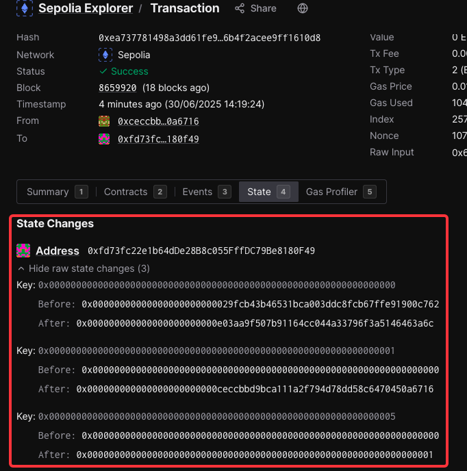
## 原有owner失去safe合约的控制权
### 此时safe web2页面无法再正确加载saf合约信息
- 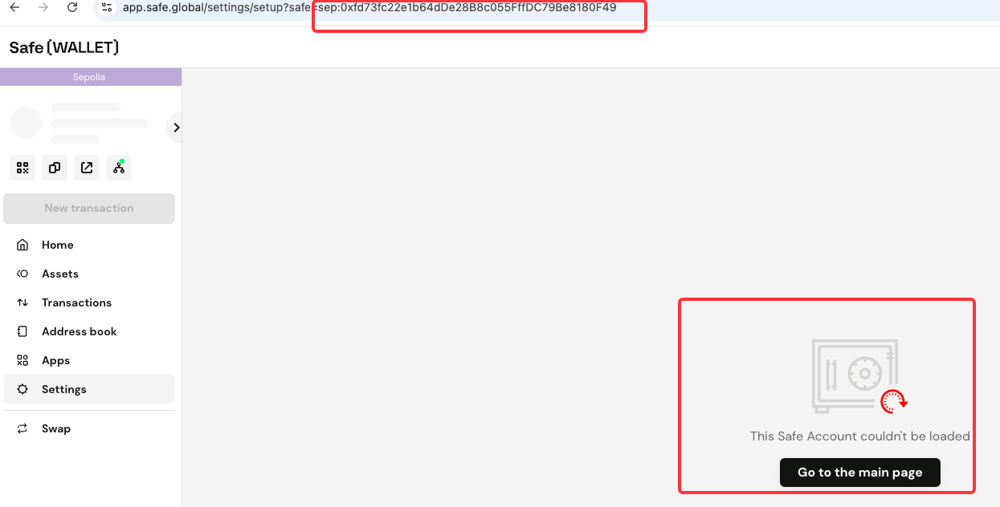
- 
## 黑客随意获取该合约资产
- 攻击完成后，黑客可以无限制的，取出safe地址中的token和coin, 
  - **注意，此时的safe合约地址仍然不变，但已经是另外一个合约了**
- [转账交易](https://sepolia.etherscan.io/tx/0x2252a6376c6946f14e8d821b3f0f64f56c61f6bbb0d141c00eaad2186ae0b7c9)
- 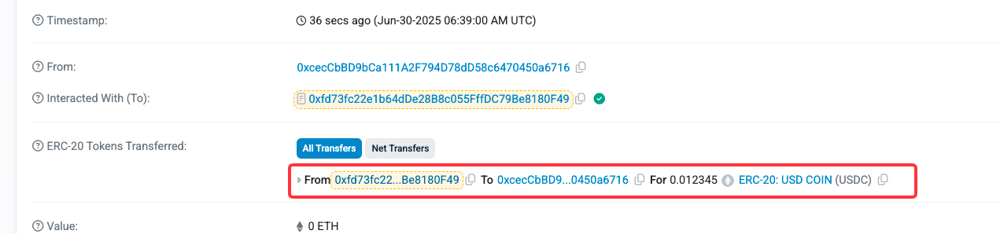

# guard模块防护后效果
## delegateCallGuard合约功能
- 在执行交易前的接口抽象中，拒绝delegateCall
- 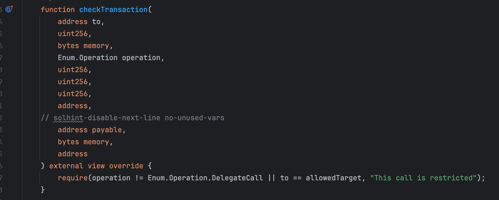
## 构造新safe合约并安装delegateCallGuard模块
- guard合约 0x8283396F444557B66e367d761174Dd9B396F53eF
  - [1.4.1版本guard.sol](https://github.com/TangCYxy/Shares/tree/main/250522%20safe1_4_1%E7%89%88%E6%9C%ACguard%E6%A8%A1%E5%9D%97%E6%9B%B4%E6%96%B0%E4%BB%A5%E5%8F%8Aguard%E6%A8%A1%E5%9D%97%E9%83%A8%E7%BD%B2%E5%92%8C%E7%BB%91%E5%AE%9A)
- 构造新的safe合约地址 0xEbf288a3C20C2551d42481242D0cA1D8826D20d6
  - owner列表仍然不变
- 在新safe合约地址中绑定guard模块,[链上交易](0x5e52b0fd6e5098871afa77c56dda8cecfc1c3b2f18cbd6f29a7aedaea74a5f2e)
  - 在transactionBuilder中构造绑定交易 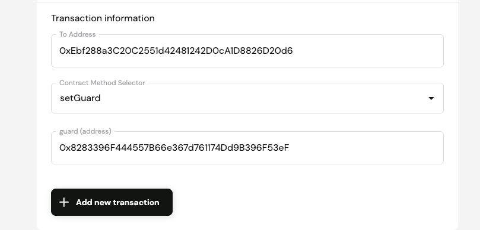
  - 绑定成功后，safe settings出现变更 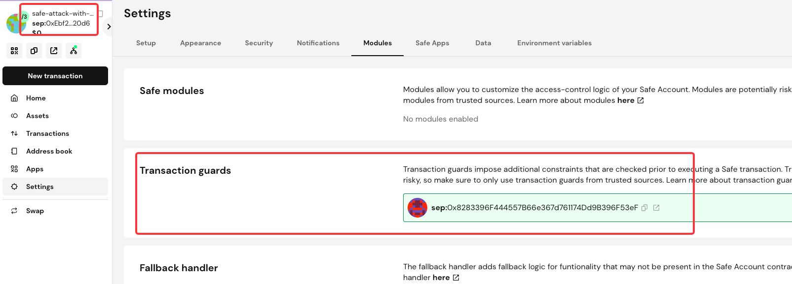
  - [完整绑定流程见b站分享](https://www.bilibili.com/video/BV1xiJWzyE8v/?share_source=copy_web&vd_source=ce0cad875b0b4c2a4efa014c699df898&t=590)
## guard模块效果
### 不影响常规使用
- 此时能正常转出和使用资产，如erc20
- 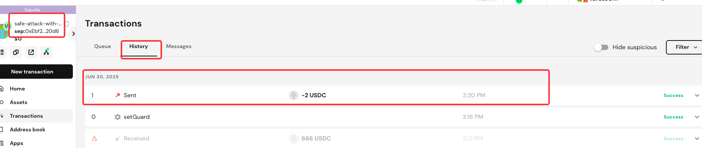
### 能阻止非法的delegatecall交易
- 无法执行delegatecall（即不存在被替换slot0的可能性）[链上交易](https://sepolia.etherscan.io/tx/0x72ab32d3aa5e49780799a533d838fadf96a9ce699f5bbd6ea38d1db0565b907d)
- 同样的attack交易，无法在装载了guard模块的新safe合约地址上通过
  - 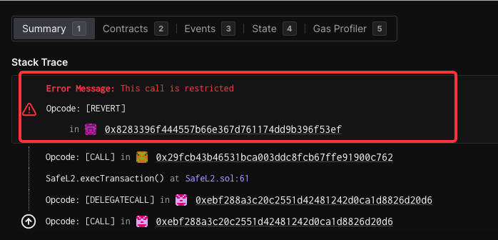
  - 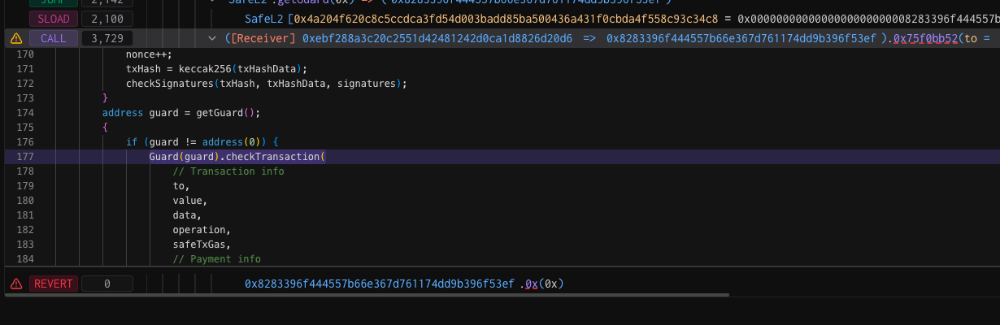
  - 
# 相关资源
- 测试的攻击合约，**仅用于安全演示！**
  - [Payload.sol](./evm/src/SafeAttackPayload.sol)
- 使用java构造的测试代码
  - [Attack.java](./java/safe-attack-payload/src/main/java/com/tc/test/Main.java)
  - 部分代码省略，仅保留演示相关的主要功能
  - 将对应的safe和owner配置信息改为自己的即可重现
    - 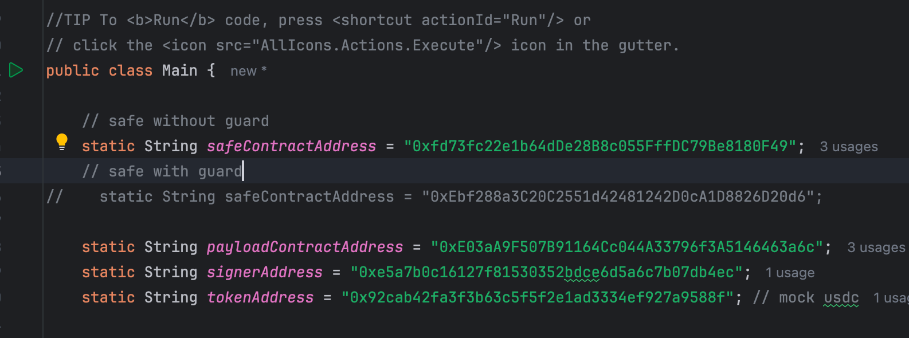