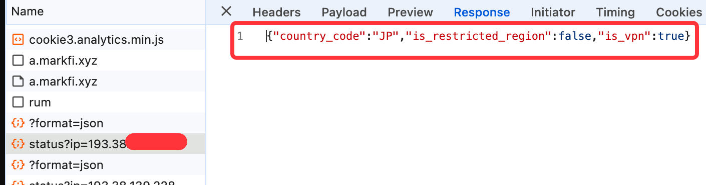
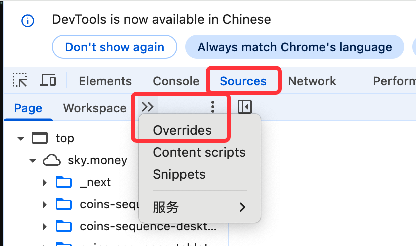
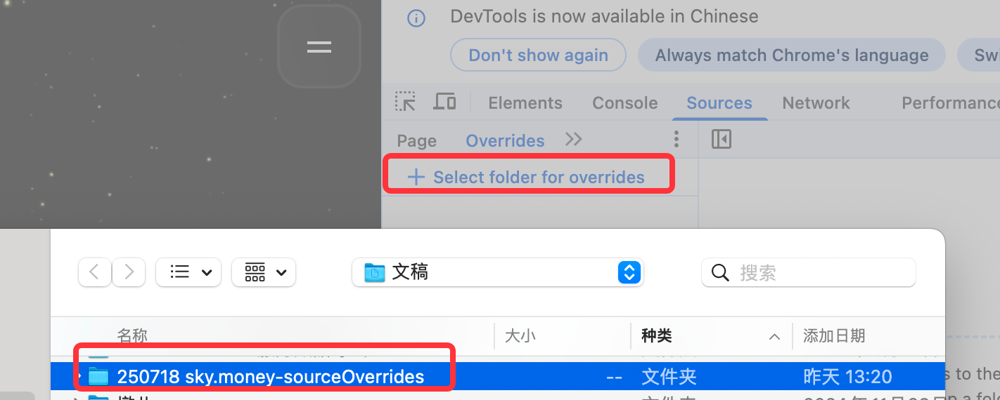
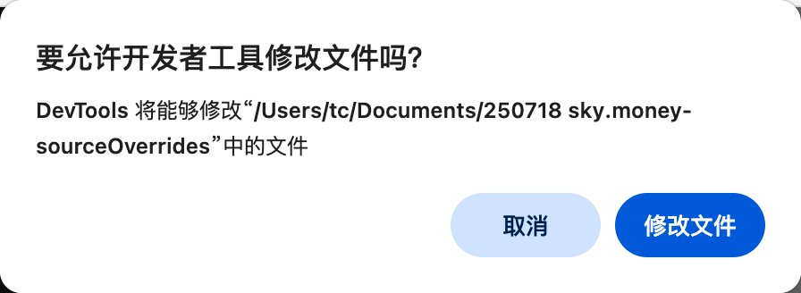
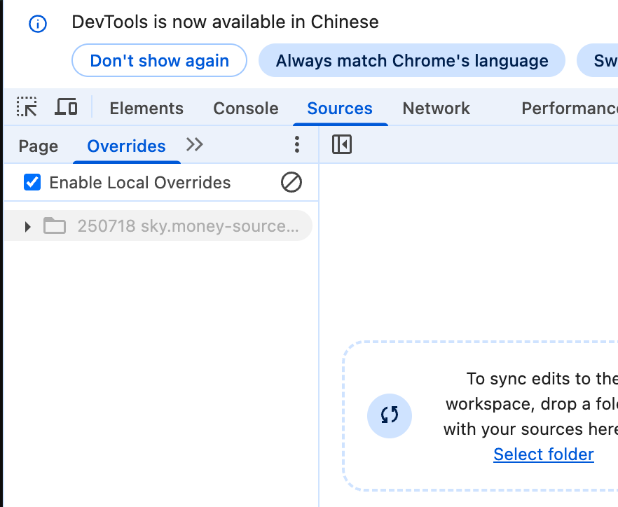
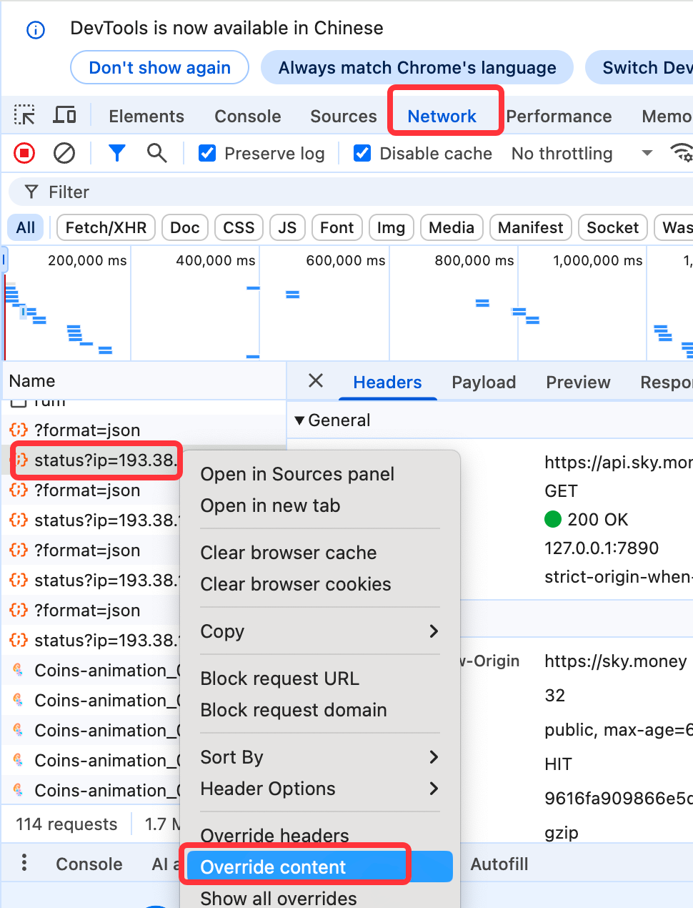
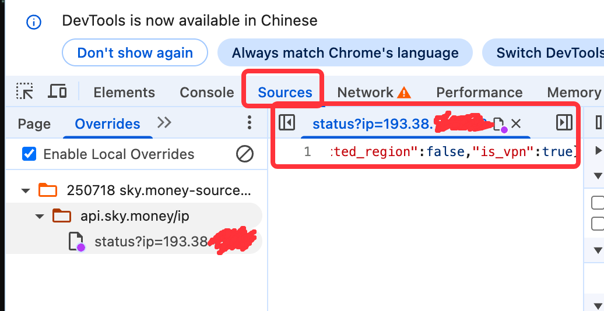
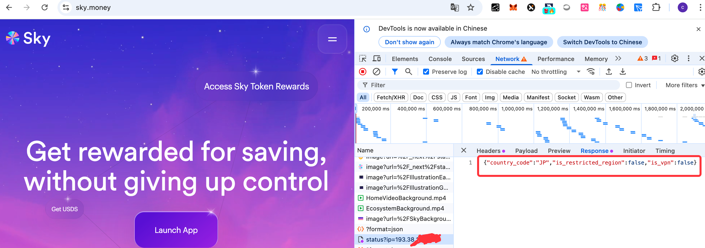

# 背景
- 新版本的[DAI(Sky + USDS)官网](https://sky.money/)经常因为ip限制的问题无法访问，

# 目的
- 解决官网功能使用的问题，方便后续深入梳理DAI逻辑（结合使用理解代码）
  - 了解DAI,AAVE等经典的defi模式，后续才能理解其他衍生的defi项目，才能理解和避免近期的GMX等攻击
- 强调安全设计，DAI官网这种ip限制策略只能拦住小白，有合规风险

# 结论
- 通过chrome浏览器自带的overrides功能可以绕过DAI官网的IP限制
- 在安全设计中，前端api尽量只处理逻辑封装，重点的安全性校验均在后端执行，对前端最小化信任。
  - 像DAI官网这种在前端页面单独给个api来确认ip限制是**非常不符合安全最佳实践的做法**。

# 操作步骤
## 打开官网（但提示异常）
- 确认无法访问
  - 无法直接访问
  - 无法通过梯子访问
    - 
## 分析url链接，确认ip限制逻辑所在api
- https://api.sky.money/ip/status?ip=193.38.xx.xx
  - 
- 不难看出，在明文的返回值中，只要is_restricted_region和is_vpn都不为true，即可通过验证

## 方案比选
- **✅** chrome local overrides方案，修改该ip查询api的返回值
  - 最简单，没什么复杂度，操作步骤也不麻烦
- 编写chrome插件，拦截并修改该ip查询api的返回值
  - 复杂度一般，但也能解决问题
- 本地filter，拦截本机对于sky.money的该ip的访问，直接本地返回固定值
  - 实现方案较多，复杂度一般

## 在chrome里开启source.overrides
- 进入source tab, 点开详细，选择overrides
  - 
- 选择select folders to overrides, 明确一个本地目录
  - 
- 允许本地磁盘操作权限
  - 
- 此时页面内容如下
- 

## 将刚才的ip限制url添加到chrome的local overrides里
- 在network tab里找到对应的url，右键选择 override content
  - 
## 在local overrides里修改对应的返回值
- 切换到sources.overrides tab, 可以看到已经出现了数据
  - 
- 将"is_vpn"改为false即可

# 刷新网页，成功正常的进入DAI官网（sky.money）
- 
- network tab中的对应ip检测接口的返回值"is_vpn"被overrides成为false

# 参考文档
- [掘金: 前端调试方案local override](https://juejin.cn/post/7380510171639857164)