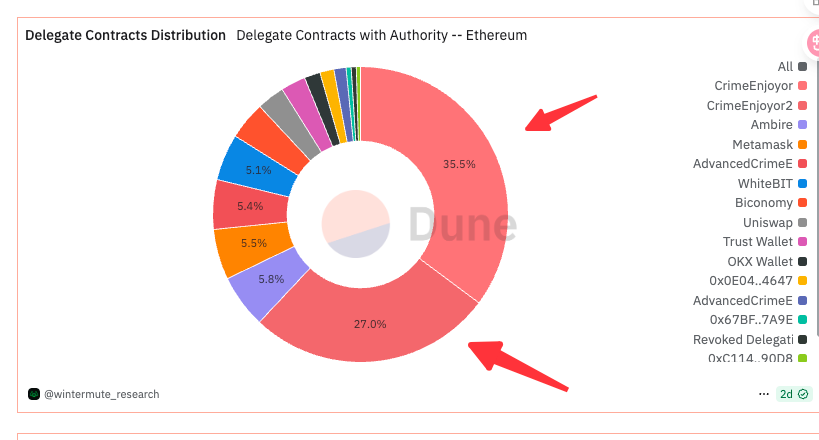
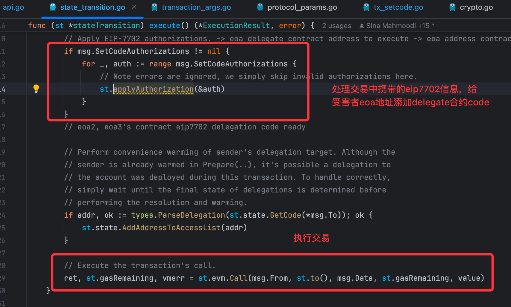
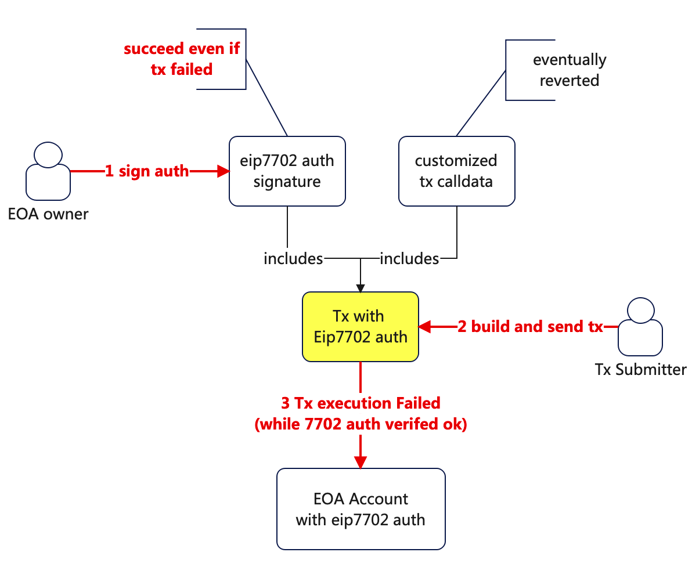
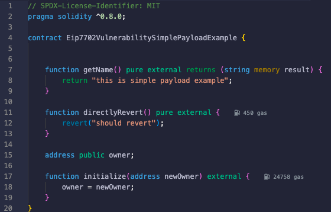
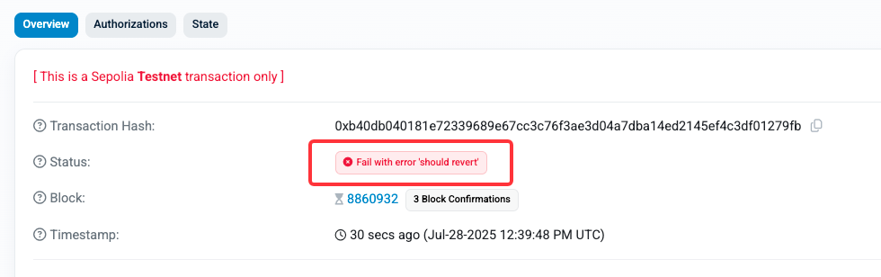
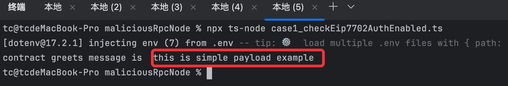
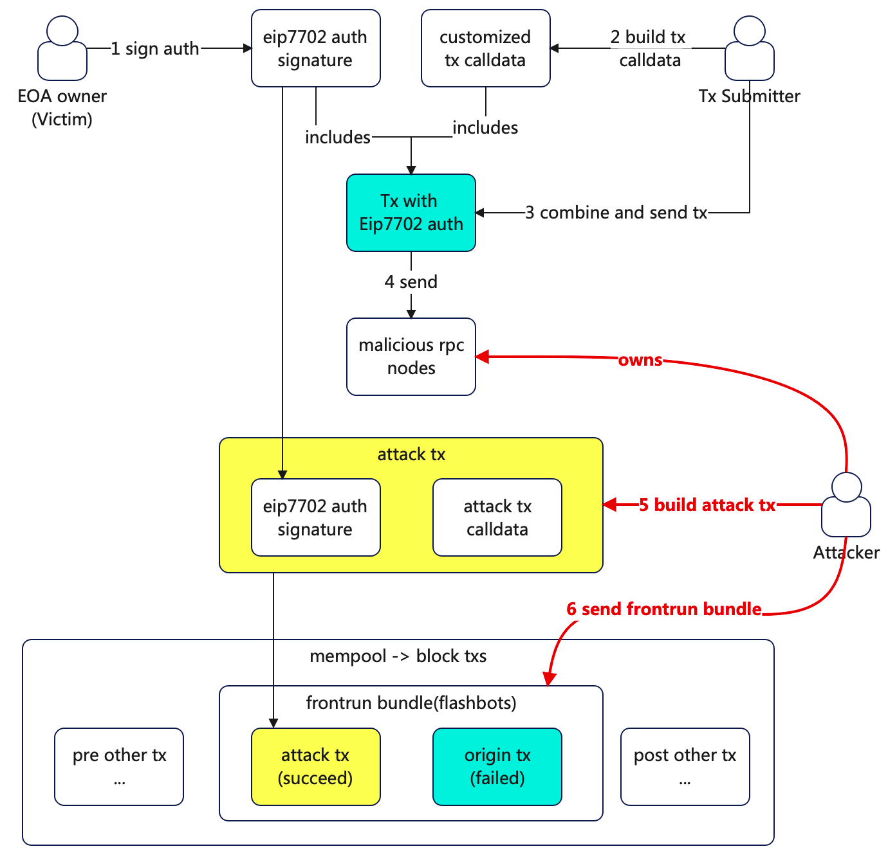
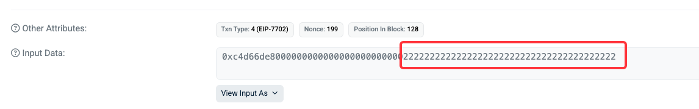
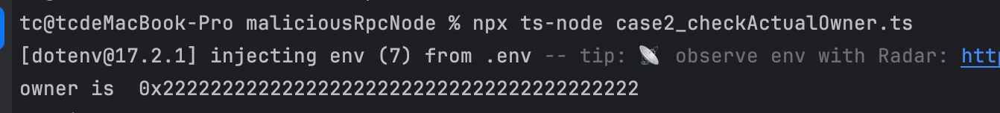

# 背景
- eip7702的出现对当前eoa的能力进行了大幅度提升, 可以在gasless等方向给区块链生态提供助力。
- 创新之后仍然也携带隐患，目前eip7702的授权仍然还是被黑客的恶意合约使用
  - [目前超过6成的eip7702授权使用均指向黑客合约, 地址代理攻击分析](https://github.com/TangCYxy/Shares/tree/main/250702%20eip7702%E4%B8%8A%E7%BA%BF%E5%90%8E%E7%9A%84%E9%92%B1%E5%8C%85%E5%9C%B0%E5%9D%80%E4%BB%A3%E7%90%86%E6%94%BB%E5%87%BB%20%E5%8E%9F%E7%90%86%E5%88%86%E6%9E%90%20%E6%94%BB%E5%87%BB%E5%A4%8D%E7%8E%B0%20%E9%A2%84%E9%98%B2%E6%8E%AA%E6%96%BD)
  - 除了作为黑客工具箱里的工具以外，eip7702本身还有较为明显的风险敞口，无法忽略
  - 
  
# 潜在的高危风险敞口
- 交易非原子性
  - Eip7702的授权initCode执行成功，但交易本身的callData执行失败，此时Eip7702授权并不会被回滚
- frontrun抢跑攻击
  - 恶意rpc节点服务或mev机器人可监听eip7702交易，获取其中eip7702授权部分，但将calldata更新为自身的初始化逻辑
  - 本质上eip7702装载后，eoa地址就是一个没有任何storage usage的空合约，可被任何地址调用初始化逻辑
---

# 结论和建议
- eip7702的授权的初始化过程需要注意其非原子性和frontrun抢跑攻击，使用过程中需要通过其他方式进一步加固，例如:
  - 灵活性限制: 在装载的payload合约中，限制为只能某些写死的地址才能访问初始化方法
    - 比如只能某个特定合约地址才能进行initialize，并且由该合约地址本身只能由部分被管理的caller访问
  - 授权装载时间点: eip7702的装载需要在地址有资产之前完成，而不是之后
    - 减少潜在的frontrun的损害

------
# Eip7702原理简述
- [eip7702的交易code解析和加载 delegatecall的code装载](https://www.bilibili.com/video/BV1guN1zkESQ/?share_source=copy_web&vd_source=ce0cad875b0b4c2a4efa014c699df898&t=373)
  - 在交易执行前，先applyEip7702的authorization，再执行交易的calldata
  - 即黑客可以在一个交易内完成 delegate恶意合约并提取受害者eoa账号上的资金
  - 

# 风险敞口1: eip7702授权信息的装载非原子性
## 风险描述
- 假设eip7702 Auth信息装载成功，但交易callData执行失败，此时授权信息的装载不会被回滚
  - 即使交易失败，也不影响eip7702授权信息的装载
  - 

## 场景构造
victim 地址 0x19Ecd19F8Aad69835E1C3204c0b99C11945C091A
### 部署简单payload合约
- [payload合约完整代码 地址在 0x809119683364418a177e09f5Fddd9e4562138d0E](./evm/Eip7702VulnerabilitySimplePayloadExample.sol)
- 
### victim地址签署授权
- victim地址签署该eip7702授权，装载payload合约8d0E
### 构造并发送交易
- 发起携带eip7702授权信息的交易
  - calldata为访问"function directlyRevert()", 强制让这笔callData失败 
    - 模拟交易callData因为各种异常revert
    - [交易发送代码](./maliciousRpcNode/case1_revertedTxSending.ts)
    ```
    npx ts-node case1_revertedTxSending.ts
    ```
- [交易revert，但eip7702授权执行成功](https://sepolia.etherscan.io/tx/0xb40db040181e72339689e67cc3c76f3ae3d04a7dba14ed2145ef4c3df01279fb)
- 
### 验证结果
- 构造一笔发送给victim地址的"function getName()"的请求，发现该victim地址实际已经被装载了eip7702delegation合约地址
  - 预期能正常响应该请求 -> 预期返回特定字符串"this is simple payload example"
    - 如果2个交易保持原子性，则这个请求不应该返回任何有效值（因为victim是EOA地址，无合约的runtimeCode）
  - [交易发送代码](./maliciousRpcNode/case1_checkEip7702AuthEnabled.ts)
    ```
    npx ts-node case1_checkEip7702AuthEnabled.ts
    ```
- 方法执行结果：

## 再次重申
- 跟eip7702授权信息一起提交的交易calldata执行失败后，eip7702的授权仍然保留
  - 核心是eip7702的授权信息装载和交易calldata执行是2个完全不同的流程
    - 前者只要验证通过，就不会revert

---

## 风险敞口2: eip7702的授权信息可能被frontrun抢跑攻击
## 风险描述
- eip7702的授权信息"**明文编码**"序列化在交易字节码中，任何收到"eth_sendRawTransaction"的rpc节点，或有能力监听pending池交易的人都可以获取该授权信息
- 假设黑客获取了某笔交易中的eip7702授权初始化信息，此时构造自己的交易callData，通过frontrun方式跑在你的交易前，就可能导致该EOA地址上的合约被黑客抢先初始化
  - 如果这个EOA地址是一个链上支付服务的gasless临时收款地址，那么可能导致地址上的资金异常的向黑客地址转移（而非正常向系统内归集）
  - 

## 场景构造
victim地址 0xE97ea3659a9c68f74B09864Ca9102A561C89F36f
### 构造一个恶意的rpc节点(或监听公开memPool)
- 部署并运行一个代理服务，将收到的rpc请求转发到公开rpc节点中，但过程中将收到的交易中的eip7702信息解析并利用
  - 监听到eip7702之后就构造并发送恶意的frontrun抢跑交易
  - [完整代码](./maliciousRpcNode/case2_index.ts)
    ```
    npx ts-node case2_index.ts
    ```
### 部署payload合约
- 复用case1里的合约 
- [payload合约完整代码 地址在 0x809119683364418a177e09f5Fddd9e4562138d0E](./evm/Eip7702VulnerabilitySimplePayloadExample.sol)

### 构造并发送交易
- 访问"function initialize(address newOwner)", 更新owner信息
  - [完整代码](./maliciousRpcNode/case2_victimTxSending.ts)
  ```
  npx ts-node case2_victimTxSending.ts
  ```

- 预期执行完毕后，该victim EOA地址上的Owner信息初始化为地址0x1111

### 恶意rpc节点frontrun交易
- 从收到的交易中解析出eip7702信息，同时构造自己的交易calldata，拼装后进行frontrun
  - frontrun可以对接flashbots等服务，构造bundle完成
  - 示例方案中，仅简单的不转发收到的eip7702
- 最终将该EOA地址上的Owner信息初始化为地址0x2222
- [黑客实际执行的交易hash](https://sepolia.etherscan.io/tx/0x5b09f6207763290991c867f45e2fb97e5d59815d899ca38f1787b32b3b552694)
  - 
  - 可以看到，交易calldata的参数已经被改成了黑客的0x2222了
### 验证结果
- 构造一笔访问"function owner()"的请求，发现该eoa地址上的owner信息是0x2222, 而不是预期的0x1111
  - [完整代码](./maliciousRpcNode/case2_checkActualOwner.ts)
  ```
  npx ts-node case2_checkActualOwner.ts
  ```
- 

## 再次重申
- eip7702的签名和授权信息跟交易的calldata没有强绑定关系，导致该授权本身可以被frontrun抢跑攻击
- 如果该eoa地址上有资产，则黑客可进一步delegation合约的初始化功能提取资产

---

# 结语

- EIP-7702方案非常有创造性，提高了evm生态的活力, 推动了未来的账户抽象的进一步发展;
- 带来的风险敞口仍然比较明显，希望社区未来进行考虑，避免将过多的复杂度和风险暴露给用户;

---
