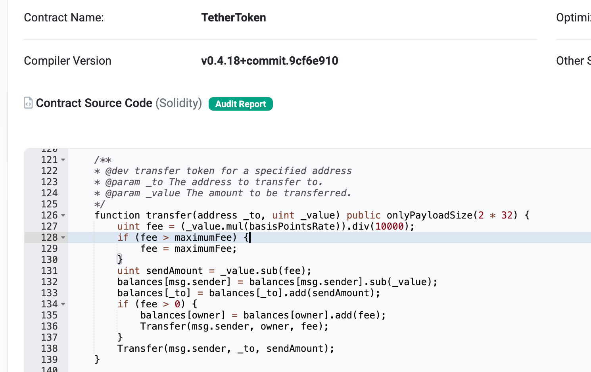
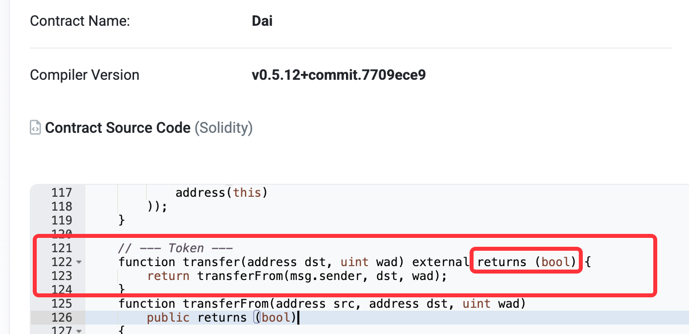
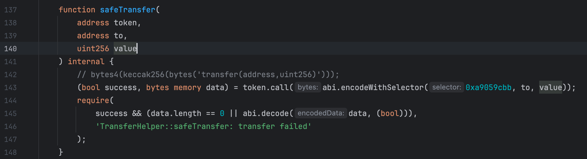
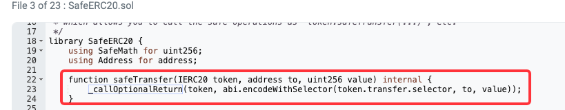
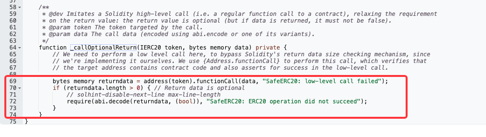
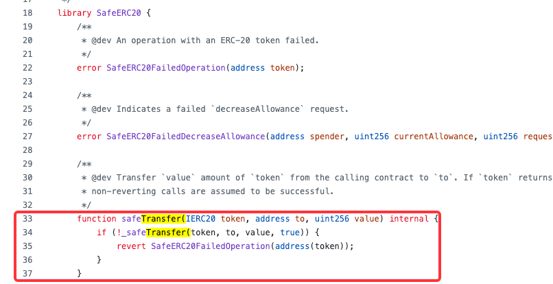
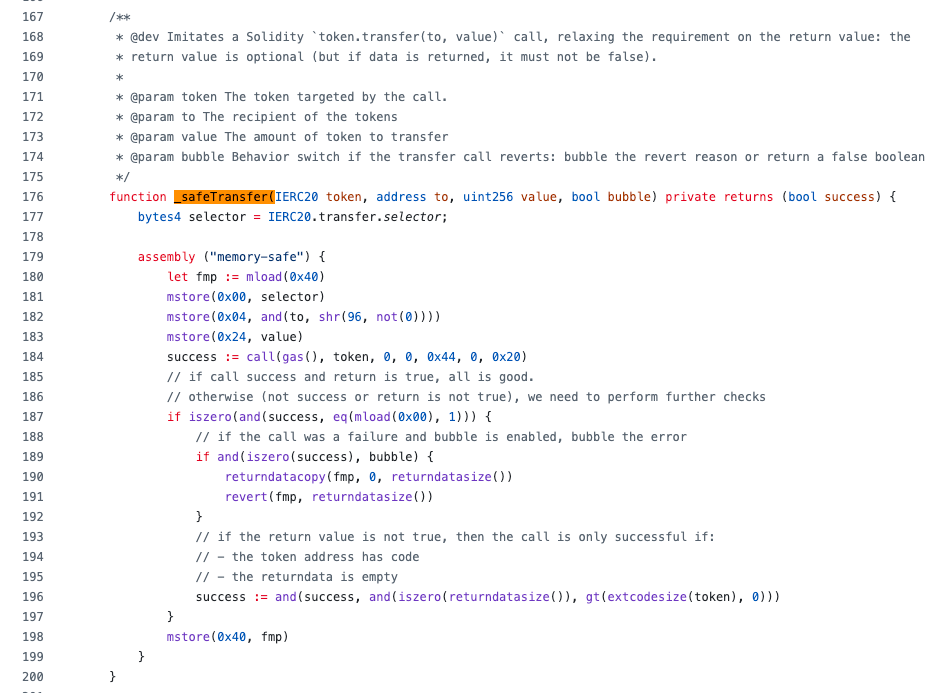

# 背景
## 常见的合约中的ERC20 Token转账形式

很多solidity合约代码中，对于ERC20 token的转账都会用如下这种非常简单的实现完成，如[USDC on polygon](https://polygonscan.com/address/0x3c499c542cef5e3811e1192ce70d8cc03d5c3359)

```solidity
IERC20(token).transfer(to, amount);

interface IERC20 {
    function transfer(address recipient, uint256 amount) external returns (bool);
}
```

## 兼容性问题
- 可能存在如下场景: 明明有余额，但交易仍然可能revert
- 如果自己写合约，在主网上处理USDT的转账，如果操作不当就可能出现这种情况，参考ethereum上的[usdt实现逻辑]([https://etherscan.io/address/0xdAC17F958D2ee523a2206206994597C13D831ec7)

## 兼容性问题的由来——ERC20标准说明

ERC20 标准（[EIP-20](https://eips.ethereum.org/EIPS/eip-20)）有规范 `transfer` / `approve` / `transferFrom` 等方法的详细定义，但是在早期实现过程中相对粗放，无法强制性控制，最终导致两种实现并存：

| 行为类型        | 示例 Token          | 说明                       |
|-------------|-------------------|--------------------------|
| 返回 `bool`   | USDC, DAI, AAVE   | 遵循标准，推荐实现方式              |
| 直接 `revert` | USDT(on Ethereum) | 无返回值，成功不返回，失败直接 `revert` |

这意味着以下代码：

```solidity
require(IERC20(token).transfer(to, amount), "Transfer failed");
```

在遇到如 USDT 这类合约时，会因为 `transfer()` 没有返回值而直接 `revert`（因 ABI 尝试解码不存在的返回值）。

## 源代码示例
- USDT on Ethereum(失败revert)
  - [https://etherscan.io/address/0xdac17f958d2ee523a2206206994597c13d831ec7#code](https://etherscan.io/address/0xdac17f958d2ee523a2206206994597c13d831ec7#code)
  - 
- DAI on Ethereum(失败返回false)
  - [https://etherscan.io/address/0x6b175474e89094c44da98b954eedeac495271d0f#code](https://etherscan.io/address/0x6b175474e89094c44da98b954eedeac495271d0f#code)
  - 
---
# 结论
- **在合约开发中，不要直接使用 `IERC20(token).transfer(...)`等方式进行转账，否则可能造成一些兼容性问题**：
  - **推荐使用 openZeppelin, USDC, BitGo等的标准实现**
    - OpenZeppelin: [https://github.com/OpenZeppelin/openzeppelin-contracts/blob/master/contracts/token/ERC20/utils/SafeERC20.sol](https://github.com/OpenZeppelin/openzeppelin-contracts/blob/master/contracts/token/ERC20/utils/SafeERC20.sol)
    - USDC on Polygon Pos(file 3): [https://polygonscan.com/address/0x235ae97b28466db30469b89a9fe4cff0659f82cb#code](https://polygonscan.com/address/0x235ae97b28466db30469b89a9fe4cff0659f82cb#code)
    - BitGo: [BitGo Forwarder合约逻辑分析](https://github.com/TangCYxy/Shares/blob/main/250512%20%E5%A4%9A%E9%93%BE%E6%94%B6%E6%AC%BEforwarder%E5%90%88%E7%BA%A6%E5%88%86%E6%9E%90%E5%92%8C%E4%BF%AE%E6%94%B9/250421%20(bitGo)Forwarder.sol)


# 知名项目对于ERC20转账的兼容性处理
- 解决思路都是将特定要访问的function编码为calldata，通过底层的call()方式来进行访问。
  - 最大的不同是OpenZeppelin的实现更底层(assembly)，节省gas 

## 最简单：BitGo Forwarder.sol
### 核心代码逻辑: TransferHelper.sol
- safeTransfer()
  - 将方法参数编码成calldata -> abi.encodeWithSelector()
  - 对地址直接发起call, 判断返回值
    - 成功判定1: 如果方法succeed，并且没有返回值(兼容没有返回值的ERC20标准操作)
    - 成功判定2: 如果方法succeed, 并且返回值等于true(兼容返回bool的ERC20标准操作)
    - 失败的交易会直接触发require逻辑的检查而无法往下执行
  - 

## 中等复杂度：USDC on Polygon Pos
### 核心代码逻辑: SafeERC20.sol, Address.sol
- safeTransfer()
  - 将方法参数编码成calldata -> abi.encodeWithSelector()
  - 要求match返回值为bool
    - 成功判定1: 该方法调用成功执行，没有返回值，此时不做返回值校验
    - 成功判定2: 该方法调用成功只有，有返回值，检查是否为true
    - 失败的交易会在lib的内部revert掉, 不会再往下执行
  - 
- address.functionCall()
  - OpenZeppelin的Address库提供的封装方法（内置安全检查，错误处理等）
  - 
- verifyResult() 
  - 对方法调用返回值的进一步处理
  - 
    - 如果call的结果succeed，即理解为成功
      - 将returndata也返回
    - 如果call的结果失败，则进一步判断返回值 —— 均revert
      - 如果有返回值，revert原始的返回值
      - 如果没有返回值，则revert预设的errorMessage
## 复杂度略高: OpenZeppelin的实现
### 核心代码逻辑：SafeERC20.sol
- safeTransfer()
  - 
- _safeTransfer()
  - 
  - 重点特性
    - 添加bubble变量，显示控制在revert的时候是否返回原始返回值。
    - 纯assembly的实现，节省gas fee
    - 添加对于eoa地址的判断（要求extcodesize() > 0）
    - ...

## 简单的对比表格
| 项目     | BitGo 简版  | USDC on Polygon Pos 版 | OpenZeppelin Yul 版     |
|--------|-----------|-----------------------|------------------------|
| 易读性    | ✅ 高       | ⭕️中等                  | ❌ 低（assembly）          |
| 安全性    | ⚠️ 一般     | ⚠️一般                  | ✅ 强（额外extcodesize 检查等） |
| 兼容性    | ✅ USDT 支持 | ✅ USDT 支持             | ✅ USDT                 |
| 调试体验   | ❌ 固定错误信息  | ⭕️返回原始错误（无法bubble选择）  | ✅ 可 bubble 原始错误        |
| Gas 成本 | ✅ 中等      | ✅中等                   | ✅ 更低（省 ABI 解码等）        |

---

# 兼容性问题复现

我们可以部署如下合约来在 Sepolia 测试网上复现这个问题。

```solidity
// SPDX-License-Identifier: MIT
pragma solidity ^0.8.20;

interface IERC20Broken {
    function transfer(address to, uint256 amount) external;
}

interface IERC20Standard {
    function transfer(address to, uint256 amount) external returns (bool);
}

contract TokenTransferTest {
    function testBrokenTransfer(address token, address to, uint256 amount) external {
        // 该调用将失败如果 token 是 USDT（因为没有返回值）
        require(IERC20Standard(token).transfer(to, amount), "Transfer failed");
    }

    function testSafeTransfer(address token, address to, uint256 amount) external {
        // 兼容无返回值合约，如 USDT
        (bool success, bytes memory data) = token.call(abi.encodeWithSelector(
            IERC20Standard.transfer.selector, to, amount
        ));
        require(success && (data.length == 0 || abi.decode(data, (bool))), "Transfer failed");
    }
}
```

- 部署后，在 Sepolia 测试网上尝试调用 `testBrokenTransfer` 和 `testSafeTransfer` 分别对 USDT（Sepolia 地址：`0x516de3a7a567d81737e3a46ec4ff9cfd1fcb0136`）转账（0金额即可复现），你会看到前者失败而后者成功。
- 0金额可以转账的原因可以参见之前分享过的[0金额转账的原理分析](https://www.bilibili.com/video/BV1GD75z4EPL/?share_source=copy_web&vd_source=ddf35a2beeb153b9285efc6e3973cf05)
